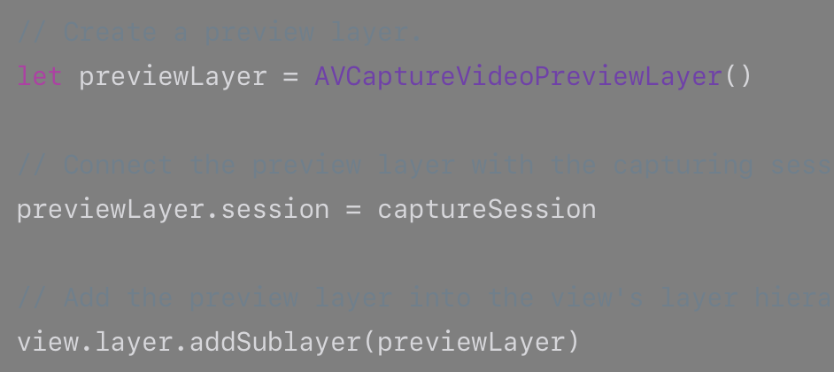
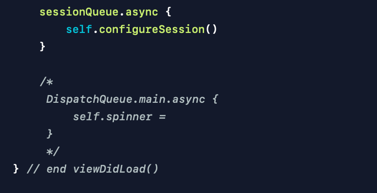
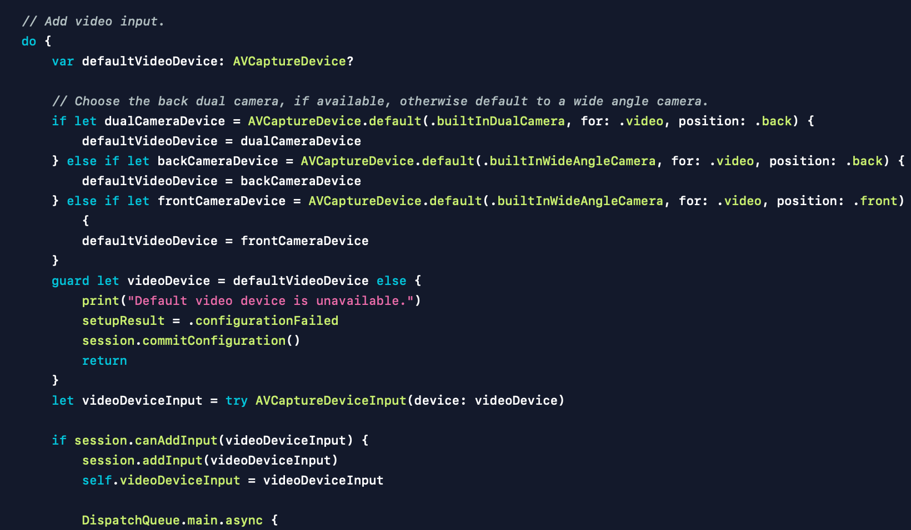
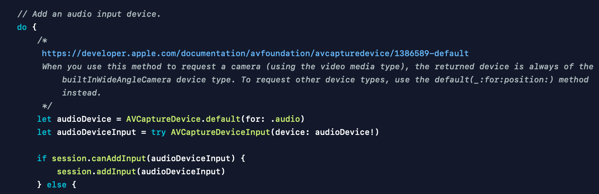

# in viewDidLoad()
### Set up the video preview view

 previewView.session = session

 

### AVCaptureDevice 권한 검사

인증된 상태면 넘어가고, 인증되지 않았으면 권한을 재요청하며, 결과에 따라 셋업의 결과를 저장해둔다. 이 결과값은 success 로 초기화 되어있으며, 실패 시 권한이 거부되었음을 저장함.

 

### 세션 구성

"session queue"라고 명명한 디스패치 큐에서 세션을 구성한다.

기본적으로 권한이 거부되어있으면 진행될 수 없기에 바로 return 한다.

세션의 구성이 시작됨을 알린다. beginConfiguration()

video input, audio input, photo output 을 각각 생성한다.

video input 은 기본적으로 후면 듀얼 카메라가 디폴트 값이 되도록 설정하며, 불가능할 시 후면 와이드 앵글 카메라로 설정하고, 그것도 안되면 전면 와이드 앵글 카메라로 설정되게끔 한다. AVCaptureDevice 가 생성되었을 시 AVCaptureDeviceInput 을 생성하여 cannAddInput 을 거쳐 addInput 을 한다. 여기서 UI와 관련한 작업이 이루어지는데, AVCaptureVideoOrientation 와 UIInterfaceOrientation 을 가지고 서로 맞추어준다. (정확히는 이해 못했다.) UI 작업이므로 main 디스패치큐에 태운다. 끝난 후 이 오리엔테이션을 프리뷰의 오리엔테이션과도 연결시켜준다. (이해 불가) input을 session 에 넘기는 작업과 Orientation 에 관련된 작업들은 cannAddInput 이 가능할 시 이루어지는 것들이기에 canAddInput 에서 거절당할 경우 "Couldn't add video input to the session" 메세지를 출력하고, 셋업 결과를 실패로 바꿔주고, 세션 설정을 종료한다 commitConfiguration)(). 그리고 이 세션 구성하는 메소드 또한 종료 return 한다.

video input 을 성공리에 마쳤으면 audio input으로 넘어간다. AVCaptureDevice 의 디폴트 값을 .audio 로 설정한다. 당연히 실패할 수 있기에 try 문을 통해 AVCaptureDeviceInput 을 생성해주고, canAddInput, addInput 을 거쳐 작업을 완료한다. 비교적 간단하다.

photo output 또한 간단하다. AVCaptruePhotoOutput() 으로 생성된 값을 바로 canAddOutput 하고, addOutput 을 한다.

 

### 의문점
1. *__왜 다른 작업 없이 바로 AVCapturePhotoOutput() 자체로 세션에 보내도 되는지 모르겠다. input 과 연계 되서 알아서 되는 걸까?__*
2. *__"session queue"라고 명명한 디스패치 큐 는 뭘까?__*
3. *__왜 input은 .video 고 output은 포토, 무비로 나뉠까?__*
4. *__AVCaptureVideoOrientation, UIInterfaceOrientation 의 정확한 의미?__*
5. *__코드에 보면 enum 타입으로 많이 선언해놨더라. 0, 1 혹은 on, off 등으로 간단하게 많이 분류해놓았는데, 이것들이 실제로 앱에서 어떻게 작동할까? on, off 같은 경우는 개발자 입장에선 알아보기가 아주 명쾌하나, 실제로 어떻게 앱이 알아먹도록 전달을 하는 걸까..?__*

 

D+1 공부해야 하는데, 요즘 컨디션이 안좋다. 3일째 두통과 체기가 가시질 않는 거 같다. 괜찮아지려고 하면 또 아프고. 마음의 병인 것 같아, 최대한 스트레스를 안 받고 지내려고 하는데 쉽지가 않다. 해야 한다는 압박과 강박을 느끼고 있어서인지 몸도 수시로 아프다. 잘 이겨내려면 행동을 해야 하는데.. 흐아!

D+2 쉬는 중

D+3 쉬는 중

D+4 쉬는 중

D+5 쉬는 중: 내일부터 다시 시작

D+6 다시 시작: 카메라 앱 출시를 향해!

 

# 공부
### * AVCaptureVideoPreviewLayer

**_[Link](https://developer.apple.com/documentation/avfoundation/avcapturevideopreviewlayer)_**

A Core Animation layer that displays the video as it’s captured.

AVCaptureVideoPreviewLayer is a subclass of CALayer that you use to display video as it’s captured by an input device.
You use this preview layer in conjunction with a capture session, as shown in the following code fragment.
     
> [번역]
>
>AVCaptureVideoPreviewLayer는 캡쳐된 비디오를 display 하는 핵심 애니메이션 레이어다.
>
> AVCaptureVideoPreviewLayer는 input device에 의해 캡쳐된 비디오를 display하는 데에 사용하는 CALayer의 하위클래스이다. 이 AVCaptureVideoPreviewLayer는 AVCaptureSession과 함께 사용한다.

  

### * AVCaptureSession.startRunning() is blocking call

Setup the capture session. In general, it's not safe to mutate an AVCaptureSession or any of its inputs, outputs, or connections from multiple threads at the same time.

Don't perform these tasks on the main queue because AVCaptureSession.startRunning() is a blocking call, which can take a long time. Dispatch session setup to the sessionQueue, so that the main queue isn't blocked, which keeps the UI responsive.

> [번역] 
>
> 캡처 세션을 설정합니다. 일반적으로 AVCaptureSession 또는 여러 스레드의 입력, 출력 또는 연결을 동시에 변경하는 것은 안전하지 않습니다.
>
>AVCaptureSession.startRunning ()은 차단 호출이므로 시간이 오래 걸릴 수 있으므로 기본 대기열에서 이러한 작업을 수행하지 마십시오. 세션 설정을 sessionQueue에 전달하여 기본 대기열이 차단되지 않도록하여 UI가 응답하도록합니다.

> [요약] AVCaptureSession.startRunning() 은 blocking call이다/ 따라서 main queue 가 blocked 되지 않기 위해서는 "Dispatch session setup to the sessionQueue" 하여야 한다. 그래야 main queue 가 keeps the UI responsive 할 수 있다. (main queue가 blocked 되지 않아야 된다는 뜻.)

 

### * 방향 전환 (Orientation)
private func configureSession() 단계에서!

AVCaptureSession beginConfiguration(), AVCaptureSession sessionPreset 설정, AVCaptureDevice default(_:for:position:), AVCaptureDeviceInput(device:), AVCaptureSession canAddInput(), AVCaptureSession addInput() 까지 왔다.

device input 까지 설정해주었으면, 이번엔 방향성을 줄 차례다. 이 작업은 main queue 에서 진행된다. 바로 여기서 알아야할 부분이 있다.

Dispatch video streaming to the main queue because AVCaptureVideoPreviewLayer is the backing layer for PreviewView. You can manipulate UIView only on the main thread.

Note: As an exception to the above rule, it's not necessary to serialize video orientation  on the AVCaptureVideoPreviewLayer’s connection with other session manipulation. Use the window scene's orientation as the initial video orientation. Subsequent orientation changes are handled by CameraViewController.viewWillTransition(to:with:).

> [번역] 
>
> AVCaptureVideoPreviewLayer는 PreviewView의 지원 계층이므로 비디오 스트리밍을 기본 대기열로 전달합니다. 메인에서만 UIView를 조작 할 수 있습니다.
>
> Note: 위 규칙의 예외로 AVCaptureVideoPreviewLayer와 다른 세션 조작의 연결에서 비디오 방향 변경을 직렬화 할 필요가 없습니다.
창 장면의 방향을 초기 비디오 방향으로 사용합니다. 후속 방향 변경은 CameraViewController.viewWillTransition (to : with :)에 의해 처리됩니다.

여기서 알 수 있는 점: 다른 데이터들은 Serialization을 거치는듯 하다. 나의 데이터가 상대가 알아먹을 수 있도록 직렬화(암호화, 인코딩의 개념! 상대적으로 Deserialization, 복호화, 디코딩이 있겠다.)를 하는 것 같은데 이에 대해선 추후에 더 공부가 필요할듯 하다. 어쨌건 여기서 비디오의 방향은 main queue에서 직접 처리하기에, 바로 UI에 영향을 미치기에 굳이 직렬화를 하지 않아도 되는 것인가?

 

### * AVMeidaType 

video input과 audio input을 따로하는 이유?
audio input을 만들기 위해 audioDevice를 생성하는데, 여기서 사용하는 default(for:) 메소드는 the returned device is always of the builtInWideAngleCamera device type 한다. 그렇다면 video, audio input의 차이점은 어디서 오는 것인가..? 왜 굳이 따로 하는 것인가?

 

### *  KVO and Notifications
private var keyValueObservations = [NSKeyValueObservation]() 를 선언하고,

private func addObservers() { 

    일련의 과정들을 통해 관측해야하는 정보들을 따온다.
    그 후 keyValueObservations.append 를 통해 한데 모은다.
}

실제로는 많이 쓰이지 않는다고는 하나, 현재 공부 중인 코드에서 KVO를 사용하고 있다.

[AVCam](https://developer.apple.com/documentation/avfoundation/cameras_and_media_capture/avcam_building_a_camera_app) 이 문서의 예제가 얼마나 최근의 것인지, 얼마나 도움이 될런지는 모르겠다. 그래도 일단 애플 공식 문서에 나와있는 예제라 파고들어 보고 있기는 한데.. 모르겠다.

하다 보면 언젠간 알게 되겠지. 이제 한 걸음 겨우 내딛은 정도로 너무 다 알려고 하진 말자.

 

### * 오늘은..
12월 29일부터 다시 차근차근 공부 시작!!