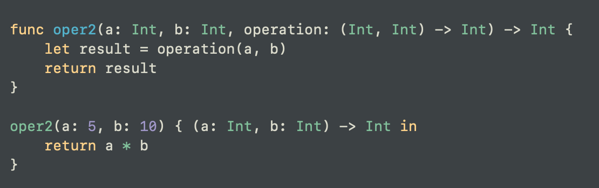
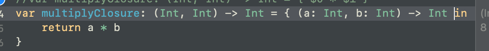
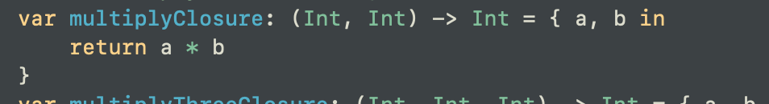
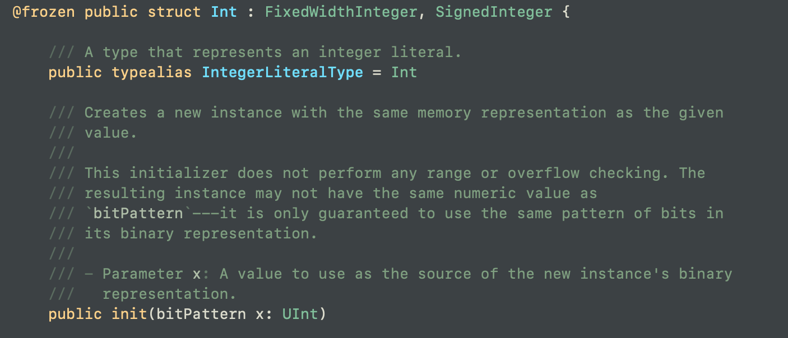
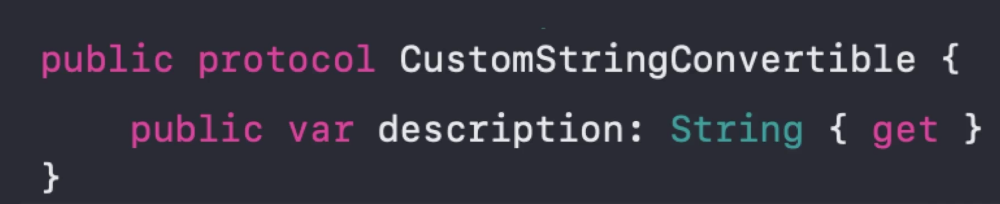
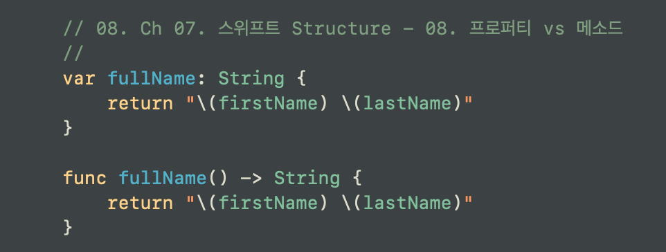
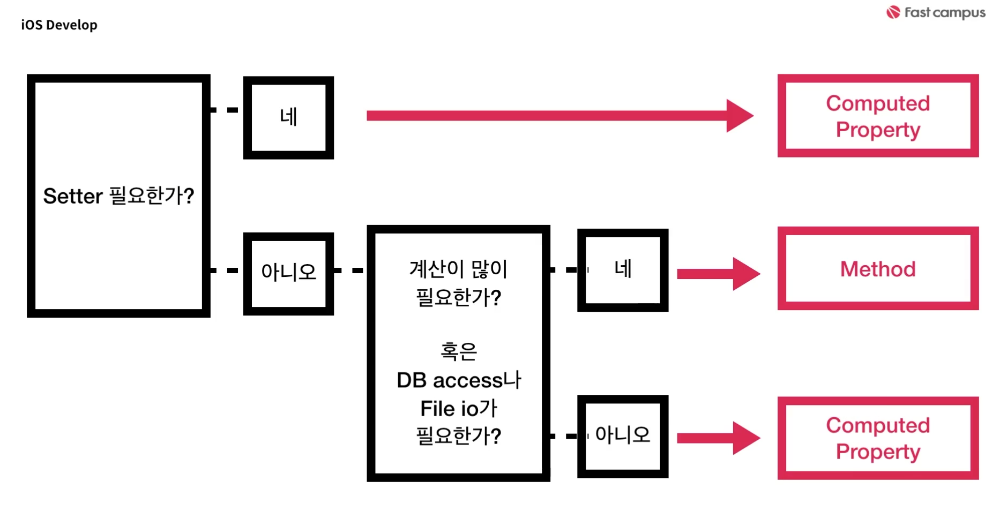

# Closure
- 클로저는 이름 없는 펑션(메소드)이다.
- 펑션에서 클로저를 파라미터로 받을 수 있다.

- 클로저는 First Class Type이다.
    - First Class Type?
        - 변수에 할당할 수 있음
        - 메소드에서 인자로 받을 수 있음
        - 리턴할 수 있음
    - 사실, 위 3가지 조건을 만족하면 First Class Citizen(1급 객체)라고 할 수 있다

- 자주 쓰이는 형태
    - Completion Block
        어떤 함수가 끝났을 때 실행되어야 하는 코드 블럭에 클로저를 자주 사용한다는 뜻
    - High Order Functions (고계 함수)
        - Input 으로 함수를 받을 수 있는 유형의 함수
        - 함수를 인자로 넘길 때 클로저를 사용한다
        - 콜렉션에서 주로 확인하게 되는 맵, 필터, 미지수(?)라던지. 이런 게 High Order Function이다.

>- 클로저 실사용 예
>
>
>
>

# Object
- Object = Data + Method
- 오브젝트의 종류: Structure, Class

- Structure Value Types & Copy: at Stack
- Class Value Types & Share: at Heap

# Protocol
- 어떤 서비스를 이용할 때 해야 할 일!
    - ex) 음악 스트리밍 서비스를 이용하기 위해서는 회원가입과 결제가 필수인 것처럼.
- Int, String 등의 타입들은 Protocol을 가지고 있다.
- (Int는 Struct이다)

- struct 타입으로 정의된 Int는 기본적으로 protocol인 FixedWidthInteger, SignedInteger을 가지고 있다.

- 가령 CustomStringConvertible 이라는 protocol을 사용하기 위해선, description을 반드시 구현해야 한다.(해당 프로토콜은 객체의 속성값을 설명해주는 프로퍼티를 가진 프로토콜이다.)

# Property
- 스위프트에서는 data 파트를 프로퍼티라고 합니다.
- Stored Property(기본 변수), Computed Property(함수), Type Property(객체 자체의 변수, 함수), ...

- Computed Property로 구현하느냐 Method로 구현하느냐의 기준은 무엇일까?

- 이 Computed Property는 호출 시 값을 반환한다.
- 이 메소드 역시 단순하게 값을 반환하는 작업만 한다.
- 이런 상황에서 무엇을 사용하는 것이 더 좋을까?

- 결론: 계산이 많이 필요하거나 DB Access나 File IO가 개입되지 않는 한은 (간단한 수준에서는) Computed Property를 사용하는 것을 추천한다.