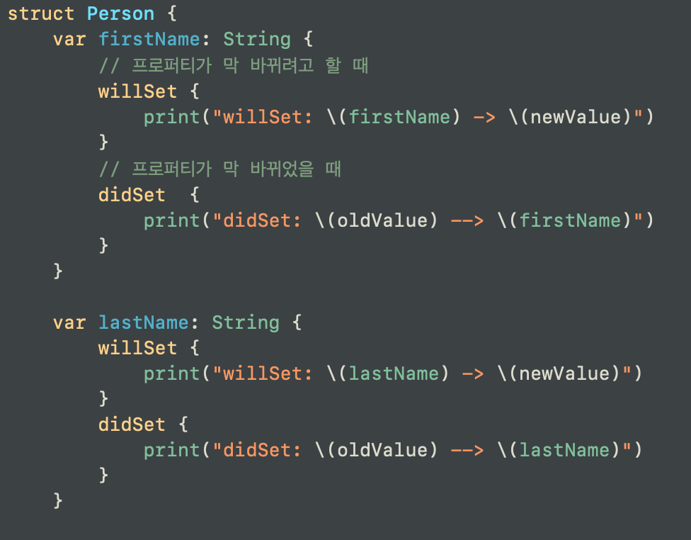
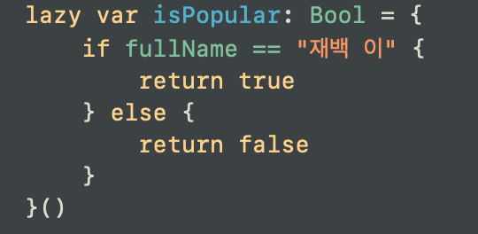
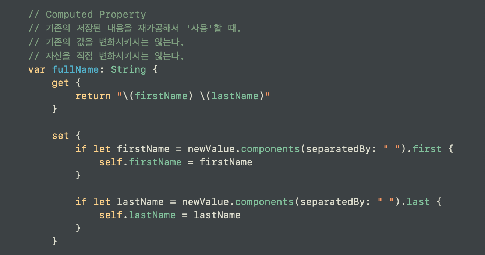
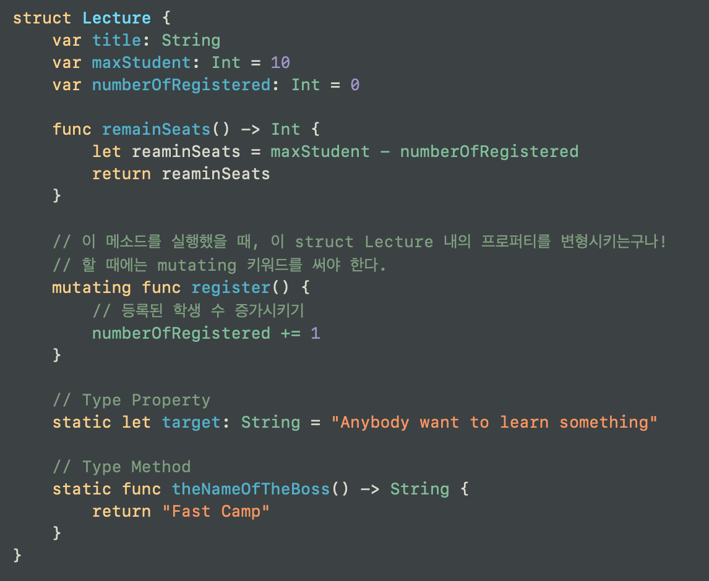
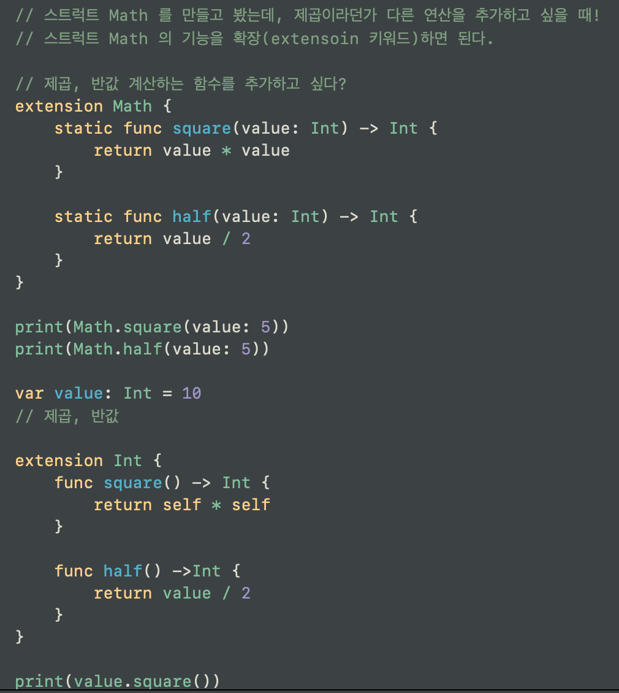
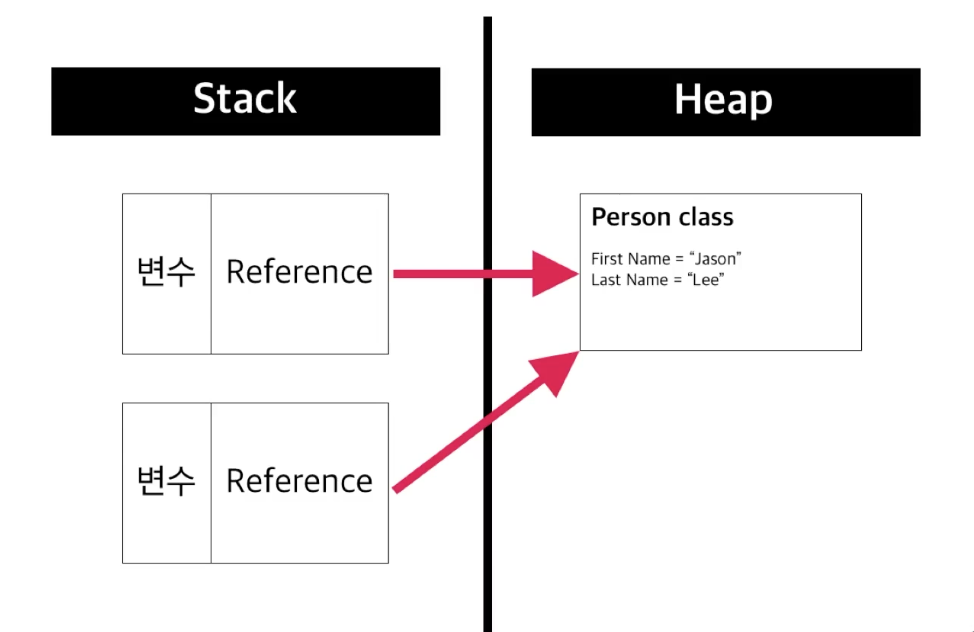
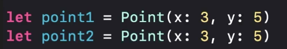
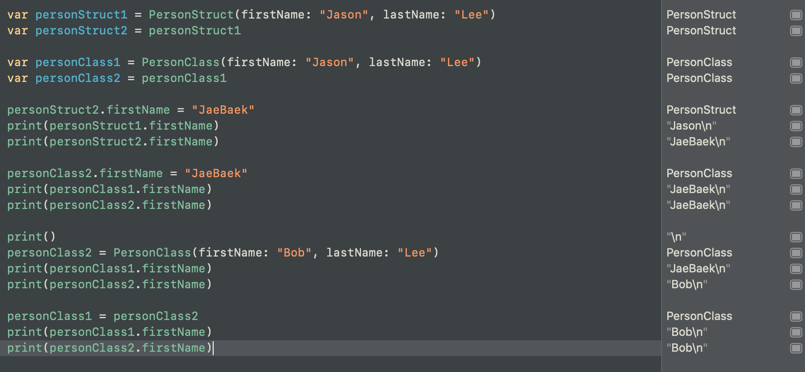

# Struct
- Struct 
- Protocol 
- Property
    - Stored Property, Computed Property, Type 
    - Stored Property에 대하여
    - 
        - 값이 막 바뀌려고 할 때 willSet [with newValue], 
        값이 막 바뀌었을 때 didSet [with oldValue]
        을 이용하여 무언가를 할 수 있다.

    - lazy 
    - 
        - 실제로 사용자가 접근을 할 때 사용할 수 있도록 생성을 한다.
        나중에 접근되는 프로퍼티인데다가, 모든 사용자에게 접근되지도 않아!
        그러면 처음부터 굳이 모든 사용자에게 쓰일 수 있도록 프로퍼티를 만들 필요가 없다. 
        따라서 Cost 측면이나, 사용자 측면에서 봤을 때 더나은 퍼포먼스를 위해 lazy 키워드를 사용한다.

    - Computed Property에 대하여
    - 
        - 기존의 저장된 내용(Stored Property)를 가지고 재가공해서 '사용'할 때 Computed Property를 사용한다.
    Property
- mutating
- 
    - 이 메소드를 실행했을 때, struct self의 프로퍼티를 변형시킨다?
    이럴 때에는 mutating 키워드를 반드시 사용하여 
    이 메소드가 자신의 프로퍼티를 변경시킨다는 것을 알려주어야 함.

- extension
- 
    - struct를 만들고 봤는데, 필요한 메소드가 없어서 추가하고 싶다? 이 때 extension을 이용해 기능을 확장한다.
    - 이럴 때에 선언한 부분에 가서 함수를 추가해도 좋으나 협업할 때에는 extension 부분에 모아놓는 것도 상당한 장점이 있다.
    - 뿐만 아니라 내가 만든 

- static
- static let isAlien: Bool = false
- struct Person의 직접적인 타입. 
- 직접적인 타입이기에 당연히, Person.isAlien 과 같이 사용한다.

# Class
- Struct와 Class는 관계가 있는 것들끼리 묶어서 표현한 것
- Object라고도 하며, 이 오브젝트는 data와 method로 구성된다.
- Object의 예: Struct, Class !
- 개념적으로는 같으나 실제 동작에서 차이가 있다.
    - Structrue: Value Types, Copy, Stack 공간
    - Class: Reference Types, Share, Heap 공간

- Stack VS Heap [프로그램 실행을 위한 메모리 공간]
    - Stack: 시스템에서 당장 실행해야하거나 타이트하게 컨트롤 및 매니징해야 하는 경우에 사용.
    함수에서 변수를 만들면 스택 위에 생성되고, 함수가 일을 다 처리하고 리턴하게 되면 해당 변수도 스택에서 제거가 된다. 그래서 **효율적이고 빠르다**
     
    - Heap: 시스템에서 클래스 같은 레퍼런스 타입을 저장하는데 사용한다. 힙은 상당히 큰 메모리 풀을 가지고 있어서 시스템의 동적 메모리 할당을 요청할 수가 있다. 대신 기본적으로 스택처럼 자동으로 데이터를 제거하지 않기 때문에 개발자가 조금 더 신경을 써줘야 한다. 그래도 엑스코드에서 개발자를 도와주고 있기는 하다.
        - 이런 복잡한 구조, 인스턴스를 힙 메모리에 할당 및 제거를 하는데에 있어 약간 더 복잡하고, 구조적으로도 효율적이지 않다보니까 스택보다는 조금 더 **느리다.**
    - 
    - Class Instance는 힙 공간에 생성이 된다.
    - 이 값을 어느 변수에다 할당할 때! 이 때 이 변수는 스택 영역에 생성이 된다. 그리고 이 스택 영역에 선언된 변수는 클래스 인스턴스의 주소를 가진다.
    - _즉, 변수는 스택에 생성이 되고, 실제 생성된 클래스 인스턴스는 힙에 생성이 된다._

# Struct VS Class
- 
- struct 값??? 을 가지고 있는 변수는 서로 간에 값을 주고 받는 것은 단순히 struct가 가지고 있는 값을 복사하는 것이다.
- class 인스턴스를 가지고 있는 변수는 클래스가 가리키고 있는 주소값을 가지고 있다. 그래서 서로 간에 주고 받으면 가리키고 있는, 참조되는 클래스 인스턴스를 가리키기 때문에, 내부의 값을 변화시킬 경우 참조되고 있는, 원본의 클래스 인스턴스의 값이 변화한다. 그래서 이를 참조하고 있는 변수들이 다 변화하는데, 이 변수들에게 새로운 클래스를 가리키게 한다면, 가리키고 있는 화살표만 바뀌기 때문에 같이 가리키고 있던 다른 변수들의 내용은 바뀌지 않는다.

- 설명이 조금 어려운데 위의 예제를 잘 읽어보면 바로 이해가 될 것!

## 그렇다면 언제, 무엇을 써야할까?
### 이럴 땐 Structure를 쓰자!
1. 두 object가 "같다, 다르다"로 비교해야 하는 경우 -> Structure

2. Copy된 각 객체들이 독립적인 상태를 가져야 하는 경우 -> Structure
![structAndClassEx3][./structAndClassEx3.png]
3. 코드에서 오브젝트의 데이터를 여러 스레드에 걸쳐 사용할 경우 -> Structure(Value Type)
한 인스턴스를 여러 스레드에서 접근하는데, 이 인스턴스가 각각 유니크한 객체여야 잠재적인 위험을 막을 수 있다.

### 이럴 땐 Class를 쓰자!
1. 두 object의 인스턴스 자체가 같음을 확인해야 할 때
    - 오브젝트의 안에 있는 데이터를 비교하는 것이 아니라 오브젝트 자체가 같은지 비교할 떄!
2. 하나의 객체가 필요하고, 여러 대상에 의해 접근되고 변경이 필요한 경우
    - iOS 앱 개발시, UIApplication이라는 앱 객체(클래스)가 있다. 이는 앱이 구동되는 데에 있어서 유일한 객체이다. 여러 오브젝트에 의해 접근이 될 필요가 있다. 이럴 땐 레퍼런스 타입을!

#### 이게 말이 어렵다면? 일단 struct로 쓰자
- 그러다가 class로 바꿀 필요가 있는 경우 class로 바꾸자.
    - 왜냐하면 struct를 class로 만드는 건 정말 쉽다.
- Swift는 Struct를 좋아해)

위 표를 보면 struct의 수가 가장 많음을 알 수 있다.

> ### **[TIP]**
> Apple 공식 문서를 보고! 문서를 뚫어버리는 습관을 가져버리면 개발에 대한 이해도가 많이 올라간다. 다른 사이트, stackoverflow 같은 곳은 그 이후에 보는 습관을 길러라.