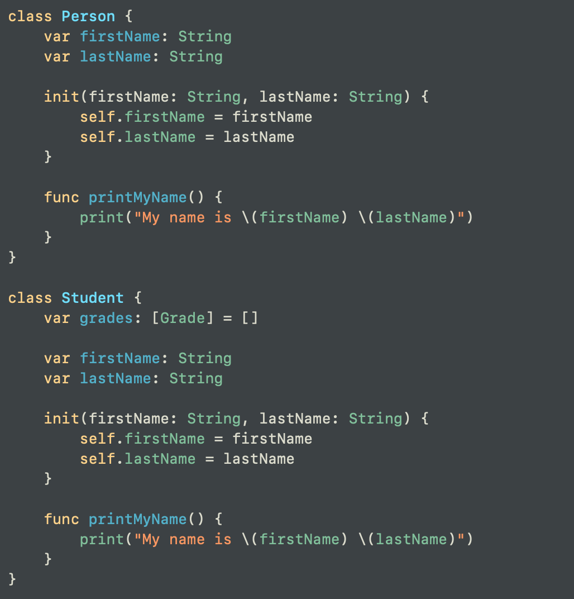
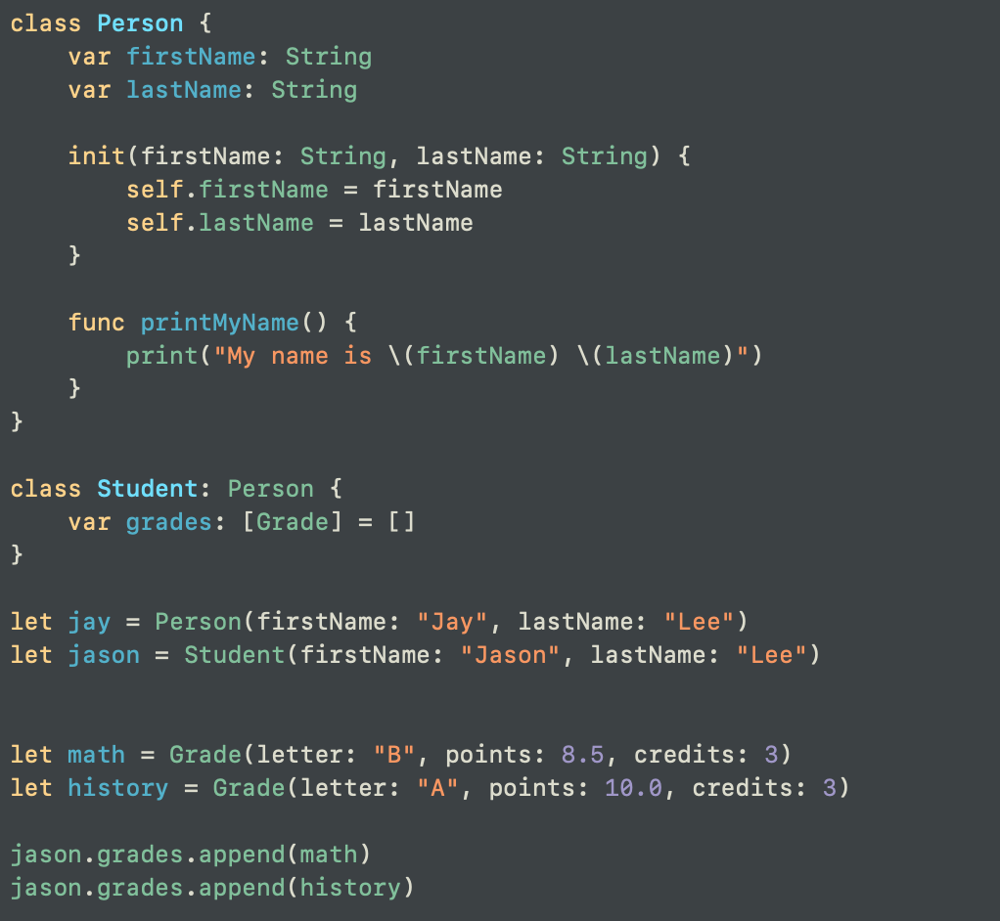
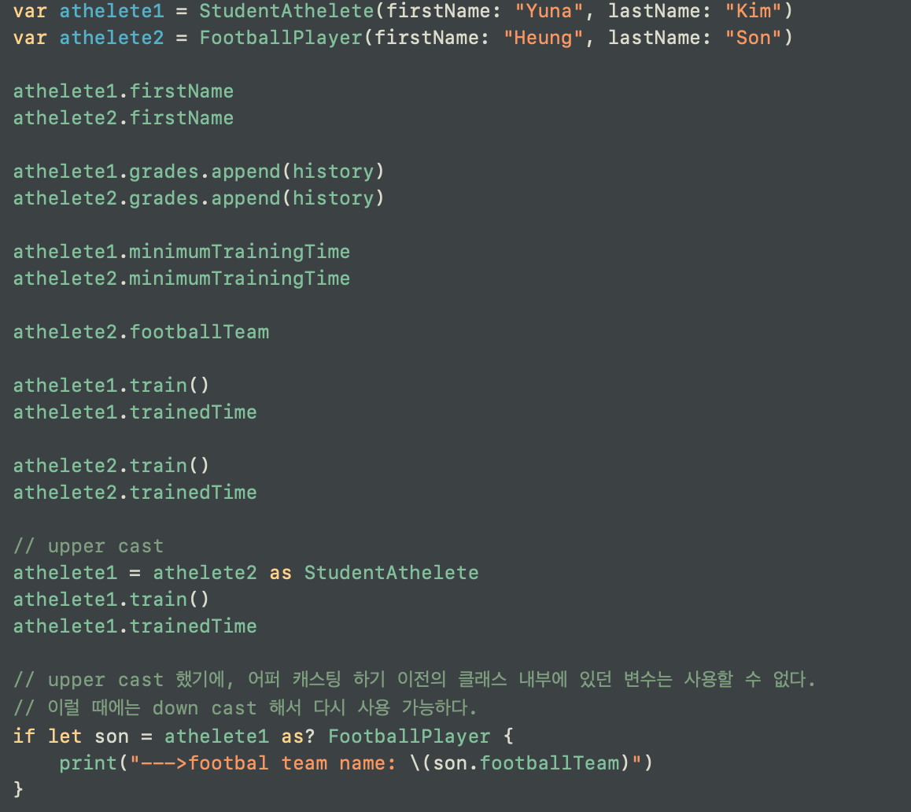

# Class의 상속 개념을 코드로 배워보자


Person 클래스와 Student 클래스가 상당히 중복되는 부분이 많다. Student 클래스의 변수 선언 var grades : [Grade] = [] 빼고는 전부 다 중복되는 셈.

프로그래밍 할 때에는 이렇게 중복되는 내용을 최소화 시켜야 한다.
여러가지 방법이 있으나 여기서는 상속이라는 개념을 통해 중복을 해결한다.

모든 학생은 사람이다 라는 명제가 성립되기에, 학생 클래스가 사람 클래스를 상속받게끔 프로그래밍 하면 된다.


이렇게!
---
## 상속의 규칙과 실습
```
- A is B ?   
학생, 선생은 사람이다. (o)
사람이 더 큰 분류이므로 학생과 선생은 사람을 상속받는다.
사람은 학생이다. (x)
모든 사람들이 학생이 아니기에 말이 안된다.

-> A는 B이다.
B가 항상 A를 포함하기에 A가 더 작은 개념!
A는 B를 상속받을 수 있다.

Person: Super Class (Parent Class)
Student: SubClass(Child Class)
```

- 상속의 규칙
    + 자식은 한개의 superclass만 상속받을 수 있다
    + 부모는 여러 자식들을 가질 수 있다
    + 상속의 깊이는 상관이 없다

- Person > Student > StudentAthelete > FootballPlayer

이런 식으로 타고 타고 들어가면서 게속 상속에 상속을 받는 클래스를 계속 선언할 수 있다.

- 
- 이 때 부모 클래스(supeer class) 타입으로 __*Upper Cast*__
가 가능하며 원래 자식 클래스(subclass)의 모습일 때 갖고 있던 서브 클래스만의 변수에는 접근이 불가하다.
따라서 __*Down Cast*__ 를 해준 후에 다시 사용이 가능하다
- Upper Cast: as 뒤에 되고 싶은 상위 클래스
- Down Cast: as? 뒤에 되고 싶은 하위 클래스
---
## 그렇다면 상속은 언제 사용하면 좋을까?
> 이는 개발 철학에 따라 다르기에 정답은 없는 부분이다.
>
>장점: 중복되는 코드를 제거할 수 있는 장점
>
>
>단점: 상속이 너무 잦아지면(=너무 깊어지면) 유지 보수가 어려울 수 있다.
>
>판단에 도움이 될 수 있도록 다섯가지 관점을 준비해봤다 (by 이준원 강사님)

1. Single Responsibility (단일 책임)
    + 각 클래스는 한 개의 고려 사항(책임)만 지면 된다. 클래스 하나가 여러 가지에 대해 신경쓰려고 하면(여러가지를 책임지려고 하면) 클래스의 정체성이 모호해지기 마련. _**사실 이 부분은 클래스에만 해당되는 것이 아니다**_
        * ex) 골키퍼가 밖으로 나와 공격수 역할을 하진 않는다. 골문을 지키는 역할만 제대로 하면 된다.

2. Type Safety (타입이 분명해야 할 때)
    + 클래스 간에 명확한 구분이 필요할 때 [부모 클래스와 자식 클래스로 분류를 해야하는가]
        * 축구 동아리가 있는데, 이 동아리는 예술대학생이나 공대생은 원하지 않는다. 운동부인 학생들만 뽑고 싶다. 이럴 때에는 Student 클래스를 상속받은 운동부 학생 클래스를 선언한다.

3. Shared Base Classes (다자녀가 있다!)
    + 기본 동작이 다양하게 구현되어야 하는 경우
        * 학생은 학습한다는 공통적인 기능이 있다. __*근데*__ 미대생과 공대생과 체대생은 각자 다른 것들을 학습할 것이다.

4. Extensibility (확장성이 필요한 경우)
    + 학생 객체를 만들어두면, 이 학생 객체를 상속받아서 미대생, 의대생, 체대생을 만들 수 있다. (학생 객체를 조금 더 구체적으로 확장!) 
    + 캔이라는 클래스를 만들어서 다른 팀에 전달. 다른 팀에서는 콜라 캔, 맥주 캔 등 각자 필요한 캔들을 만들 수 있다.

5. Identity (각각을 파악하기 위해서. 각각의 정체성을 구분짓기 위해서.)
    + 어떤 클래스인가, 어떤 객체인가를 판단할 때 상속을 통해서 검증을 할 수가 있다.
        * 어떤 인스턴스가 있는데, 어떤 변수가 있는데. 그게 학생이긴 학생이야. 근데 이 사람이 체대생이야 미대생이야? 이럴 때에는 타입을 확인해서 이 사람이 학생인데 체대생이구나, 학생인데 미대생이구나 를 알 수가 있다.  

> 이런 기반들을 근거로, 자신만의 개발 철학을 가지면 좋다.