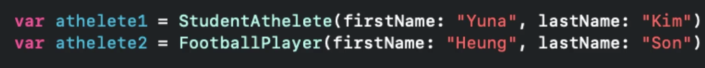
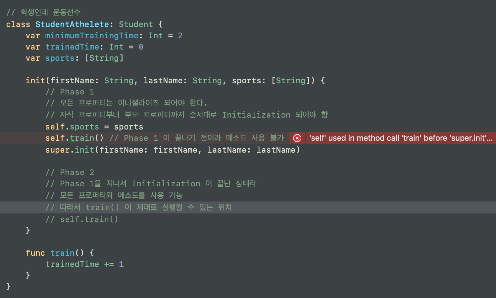
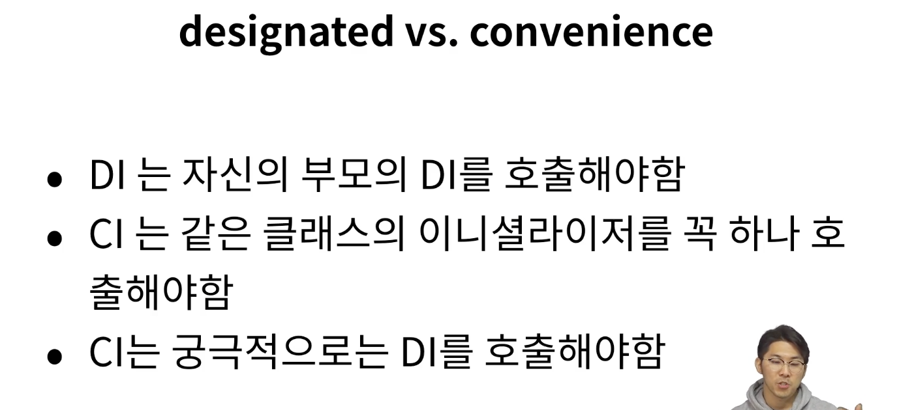

# Initializer

이때까지는 부모 클래스와 자식 클래스의 생성자가 같았다.
그러나, 당연하게도! 자식 클래스의 생성자는 부모 클래스의 생성자와 다르게 할 수 있다.
그리하여 이번 시간에는 아래와 같이, 자식 클래스의 생성자를 조금 다르게 해보려고 한다.

- 2-Phase Initialization (클래스 생성시 2가지 단계로 이루어짐)

- Phase 1: 모든 프로퍼티는 이니셜라이즈 되어야 한다. 
    + 이때 자식 프로퍼티부터 끝내고, 부모 프로퍼티로 올라간다.
    ![InitializerEx3][./InitializerEx3.png]
    + Phase 1 이 끝나기 전까지는 프로퍼티도 메소드도 사용할 수 없다는 규칙이 있다.
- Phase 2: Phase 1 에서 부모 클래스의 프로퍼티까지 다 이니셜라이즈를 하고 나서, 프로퍼티와 메소드를 사용 가능하게 된다.

> 만약! 이런 규칙이 없다면, 이니셜라이저에서 프로퍼티가 세팅도 되지 않은 상태에서 인스턴스 메소드를 호출했을 때 원하는 방식으로 동작하지 않을 수 있다. BUG 초래.

- Phase 2의 예시

## Initializer 몸집 줄이기
> 자식 클래스가 늘어나고, 자식 클래스의 변수도 늘어나면, 생성자가 계~속 길어진다.
이를 한번 줄여보자!
>
> 모든 파라미터가 항상 쓰이는 것은 아닐 것이다. 
>
> 이 때 convenience 이니셜라이저를 사용한다.

[Designated Initializers and Convenience Initializers (Swift 5.3)](https://docs.swift.org/swift-book/LanguageGuide/Initialization.html)
> Class Inheritance and Initialization
All of a class’s stored properties—including any properties the class inherits from its superclass—must be assigned an initial value during initialization.
>
>Swift defines two kinds of initializers for class types to help ensure all stored properties receive an initial value. These are known as designated initializers and convenience initializers.
>
>Designated Initializers and Convenience Initializers
Designated initializers are the primary initializers for a class. A designated initializer fully initializes all properties introduced by that class and calls an appropriate superclass initializer to continue the initialization process up the superclass chain.
>
>Classes tend to have very few designated initializers, and it is quite common for a class to have only one. Designated initializers are “funnel” points through which initialization takes place, and through which the initialization process continues up the superclass chain.
>
>Every class must have at least one designated initializer. In some cases, this requirement is satisfied by inheriting one or more designated initializers from a superclass, as described in Automatic Initializer Inheritance below.
>
>Convenience initializers are secondary, supporting initializers for a class. You can define a convenience initializer to call a designated initializer from the same class as the convenience initializer with some of the designated initializer’s parameters set to default values. You can also define a convenience initializer to create an instance of that class for a specific use case or input value type.
>
>You do not have to provide convenience initializers if your class does not require them. Create convenience initializers whenever a shortcut to a common initialization pattern will save time or make initialization of the class clearer in intent.