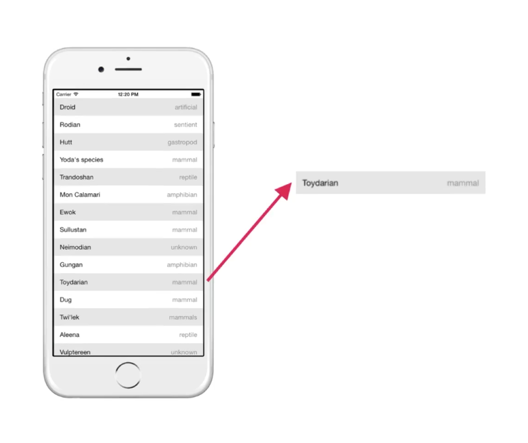
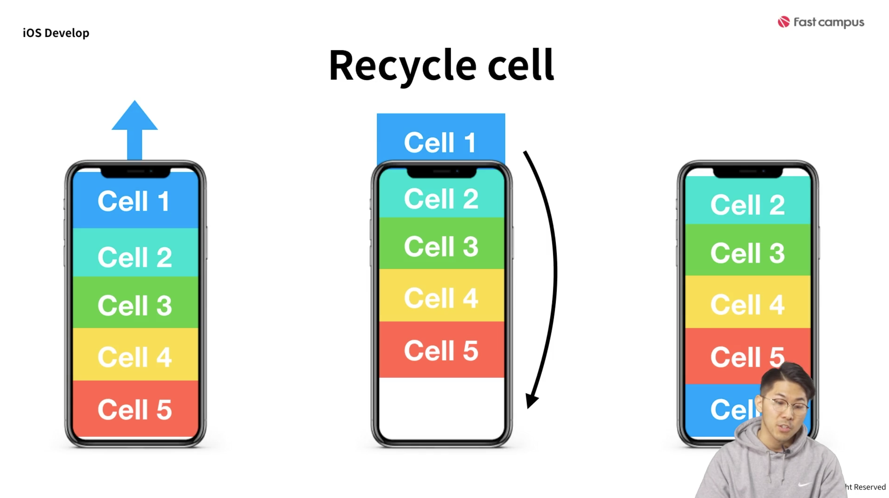

# 원피스 현상금 랭킹 앱 개요
1. 화면은 두 개로 구성 된다. 
    + 테이블뷰로 각 현상금들을 보여주는 화면
        * 여러 아이템들을 __*리스트로*__ 보여주고 있음
        * __*리스트*__가 이번 장의 주요 학습 내용  
    
    + 셀을 누를 경우 자세한 내용을 모달로 띄워주는 화면
        * 모달(Modal)이란, 화면의 아래에서 위로 올라오는 스타일의 뷰 전환 방식
    

2. 대다수 앱에서 리스트 형태로 아이템들을 나열해서 보여주는데, iOS 앱 개발에서는 UITableView를 주로 이용해서 보여주게 된다.
> UITableView는 여러 아이템을 리스트 형태로 보여주기 위한 뷰
> UITableView는 컬럼을 여러개 갖지 않고, 한개만 갖는다.
> 대신에 데이터를 여러 행에 걸쳐서 보여준다.
> 
> 각 데이터들은 테이블뷰 셀을 통해 표현된다.
> Cell은 시스템에서 제공해주는 디폴트 값을 사용해도 되고, 개발자가 커스터마이징해서 사용할 수도 있다.
> 요약: 테이블 뷰는 셀을 통해 데이터를 표현하고, 셀은 임의로 커스터마이징 할 수 있다.
> 그리고 이 셀을 재활용해서 사용한다.
> 예를 들어 데이터가 100개인데, 한 화면에서 보여지는 건 20개라고 가정을 해보자. 그럼 나머지 80개는?
> 모든 데이터에 대해 셀을 만들면 100개나 만들어야 하므로 비효율적이다. 화면에 보여지는 만큼만 셀을 만들고 재활용해서 사용한다. 화면을 스크롤해서 내려가면 셀을 재활용해서 다음 데이터를 받아온다. (Recycle Cell)
> 

> 테이블 뷰를 왜 써 ? 여러 아이템을 리스트 형태로 보여주기 위해 쓴다.
> 테이블 뷰를 이용해서 리스트를 표현하려고 할 때, 테이블 뷰를 뷰 컨트롤러에다가 추가를 했다. 추가하고 나서 실제로 사용하려고 하면, 테이블 뷰가 데이터를 보여주기 전에 질문을 한다. 
> - 테이블 뷰의 셀은 몇 개? (셀로 표현할 전체 데이터의 갯수)
> - 테이블 뷰는 어떻게 보여줄까 (어떤 셀을 이용해서 보여줄 것인지)
> - 테이블 뷰가 클릭되면 어떻게 할 거야?
> - 이런 상황 말고도 다양한 상황에 대해 물어보는 것들이 많다.
> 우리는 UITableView를 이용해서 데이터를 보여줄 때, 테이블 뷰의 질문에 모두 답할 필요는 없으나 꼭 답해야 할 두가지가 있다.
> __*테이블 뷰 셀이 몇개인가? 어떤 셀을 이용해서 보여줄까?*__
> 조금 더 추상적으로 생각을 해보자면, 테이블 뷰라는 리스트 형식을 보여주는 서비스를 이용하기 위해서는 해야할 일들이 있는 법!
> 해야 할 일의 개념, Protocol !! 해당 서비스를 이용하기 위해서 해야 할일들의 목록
> 앱 개발을 하면서 앞으로 수많은 프로토콜을 마주하게 될 것. 이번 시간에는 TablieView라는 서비스를 이용하기 위한 Protocol을 마주하게 된 것
> __*테이블 뷰 셀이 몇개인가? 어떤 셀을 이용해서 보여줄까?*__ 를 물어볼 때, 두 명의 대리인을 통해서 물어본다. UITableViewDataSource, UITableViewDelegate !
> 테이블 뷰를 뷰컨트롤러 안에 추가했기 때문에, 이 뷰 컨트롤러가 각각의 프로토콜을 준수한다고 코딩을 한다. 이렇게 준수한다고 코딩을 하는 순간, 테이블 뷰가 물어보는 질문에 대해 답을 할 것이다! 라고 답을 하는 것이다. 이렇게 되면, 이제서야 테이블 뷰를 사용할 수 있게 된다.