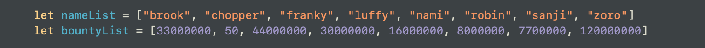
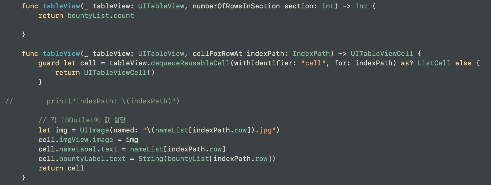
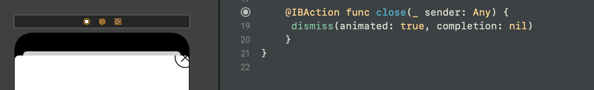
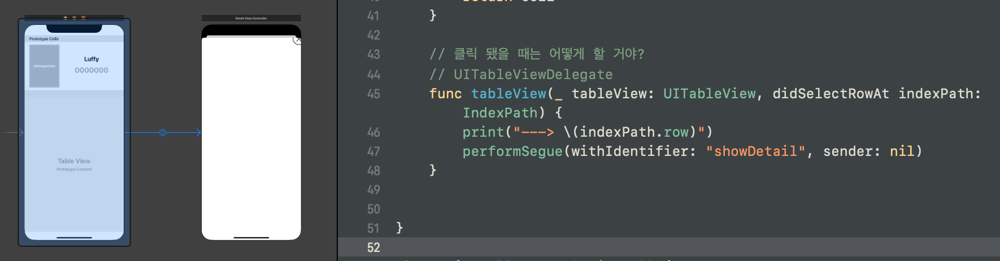
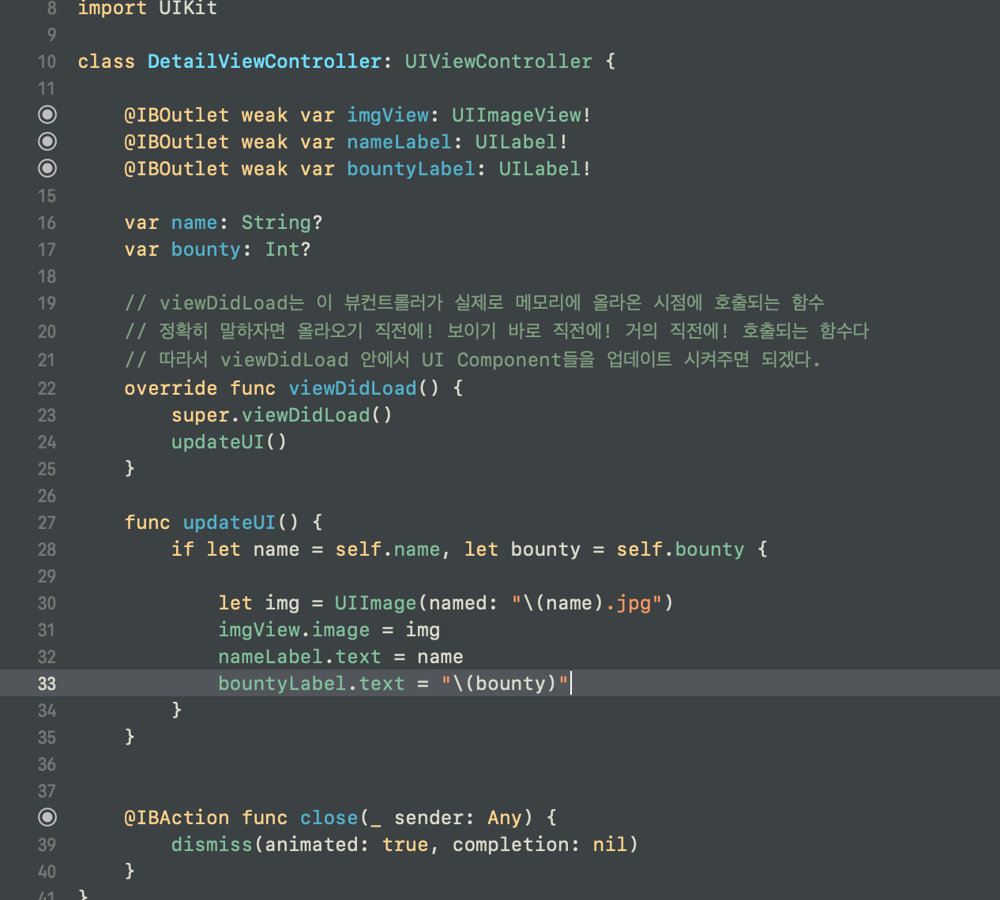
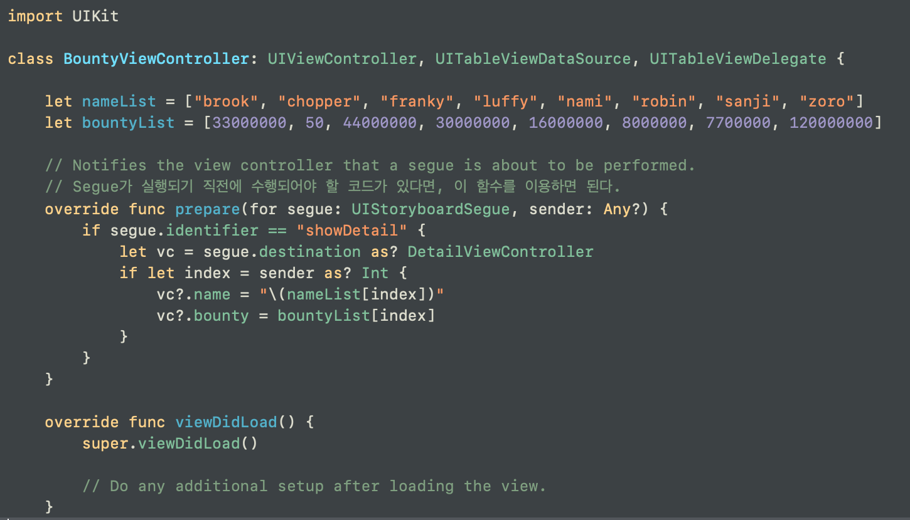
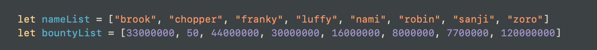

# 1. 프로젝트 생성
## AppDelegate
AppDelegate.swift 는 앱이 실제로 실행할 때 여기 있는 메소드들이 호출되는 것이다.
> 이번 앱 만드는 데에 있어서 목표는 테이블 뷰를 통해 아이템을 리스팅하는 것

## 2. ViewController 파일 새로 만들고,
스토리보드로 가서 연결시키고, 테이블 뷰를 만들고, 테이블 뷰에 대해서는 바로 오토레이아웃을 해주고! 그 안에 데이터가 리스팅 될 테이블뷰셀을 추가한다
> class ListCell { @IBOutlet, ......  } 하면 오류가 난다. 왜? class의 타입이 정해지지 않았다. UITableViewCell을 상속받아야, 셀에서 이 클래스를 인식할 수 있다. !!!

## 3. TableView를 위한 Protocol
TableView 서비스를 이용하기 위해서는 셀의 갯수가 몇개인지, 어떤 셀을 이용해서 표현할 것인지 반드시 알려주어야 한다. 이를 위해 두 가지 프로토콜을 준수하여야 한다.
- UITableViewDataSource, UITableViewDelegate !

> __*이 때 코드를 작성했지만! 우리는 이 코드가 스토리 보드 내부의 UITableView와 연결되어 있지 않다 우리는 UITableView의 DataSource와 Delegate가 어느 ViewController를 향해 질문할 것인지 세팅을 안해놓았다는 뜻 !!!!*__

## 4. 이번에는 Custom Cell을 만들고, 이 Cell을 눌렀을 때 뷰 컨트롤러가 하나 더 뜨게 만들 것이다.
1. 스토리보드로 가서 셀을 커스터마이징한다.
    * TableViewCell 오브젝트의 Indentity Inspector로 가서 Class의 이름을 바꾼다.
    * 원하는 오브젝트들을 추가하여 꾸민다.
2. 이 뷰컨트롤러에 해당하는 파일로 가서, 커스텀 셀의 프로퍼티들을 만들어준다.
    * class ListCell: UITableViewCell {} 로 만들었고, 이 ListCell이 해당 셀의 아이덴티티 인스펙터에 들어갈 이름이 된다.
    * 그리고 셀 내부를 꾸민 객체들에 맞게끔 변수들을 선언해준다. @IBOutlet weak. ...
    * 스토리보드의 각 객체들__*(UI Component)*__과 연결되어 있는 파일의 내부의 각 변수들을 연결시켜준다.

3. cell에 값을 할당한다.
    * 들어온 데이터 갯수에 따라 셀의 갯수를 맞추어주고,
    * 각 cell에 데이터를 띄워줄 수 있도록 IBOutlet 변수에 값들을 지정한다.
    
    

4. 이번에는 Cell을 눌렀을 때 뜰 화면을 만들 것이다.
> Present ViewController! (새로운 화면을 띄울 것이기에 새로운 ViewController를 만들어야 함.)
    
    
* 새로운 ViewController를 만들고 버튼을 하나 추가한다. 이 버튼을 누르면 화면이 꺼지면서 이전 화면으로 돌아갈 수 있도록! 버튼의 IBAction 안에 dismiss 를 구현한다.

* 그리고 이 화면을 불러올 뷰 컨트롤러로 가서 세그웨이를 이용해 화면을 띄워주면 된다.
* 뷰 컨트롤러 간의 세그웨이를 만들고, 세그웨이에 이름을 부여한다.
* 그리고 이 세그웨이를 수행하라! performSegue 를 구현해준다. 어디서? 셀이 클릭되었을 때 화면이 전환되어야 하니 didSelectRowAt 안에다가~
> 이때 performSegue뒤에 sender는, 해당 세그웨이를 수행할 때 어떤 특정 오브젝트를 같이 끼워서 보낼 수가 있다. 지금은 그게 아니므로 nil~

## 5. 뷰 컨트롤러의 전환 간에 데이터 넘기기
> 세그웨이로 연결된 두 뷰컨트롤러의 전환 시 데이터를 넘기는 방법!
* 우선 불러와진 화면에서 데이터가 넘어왔을 경우를 가정하고, 코드를 작성을 해본다.

이렇게 데이터를 넘겨받았을 경우, 데이터를 처리하는 함수를 만들고 그 함수를 호출할 위치를 정해주었다.
그렇다면 이제 데이터만 넘겨오면 되겠지~?

* Segue와 관련된 함수 중에! performSegue를 하기 직전에 실행되는 함수가 있다. UIViewController의 함수이기에 override를 통해 구현할 수 있다. 
이 함수는 prepare(for:sender:)이며, 여기서 sender를 통해 특정 값을 주고 받을 수 있다. 셀이 클릭될 때, performSegue를 수행하고, 이 때 indexPath의 section이나 row를 넘겨주고, 넘겨 받아서 해결할 수 있다.

## 6. 다 했으면 코드 회고, 코드 리뷰를 통해 스스로의 코드를 들여다본다.
> 이세돌이 바둑을 복기하듯이.

## 7. 현재까지 부족한 점
1. 랭킹 앱이라고 하였으나, 순서대로 정렬이 되어있지 않다.
2. 이렇게 하기 위해 데이터를 들여다 보았는데, 값들이 따로 논다. 데이터가 묶여있지 않다. 묶여있지 않기 때문에 새로 데이터를 넣는 것도, 변경하는 것도 어려워진다.

- 보기에는 쉬워보일지 모르겠으나, 데이터가 더 많아진다거나 하면, 각 name들과 bounty들이 연결되어 있지 않은 게 상당히 껄끄러워질 수 있다. 이 부분을 해결하기 위해 데이터를 어떻게 좀 해보아야 한다.
> 한 줄 코드 리뷰: 실행되는 코드를 짰지만, 추가적으로 수정할 때나 재사용하기가 어려운 코드다.
> 고치기 어렵고, 재사용하기 어려운 것을 우리는 __*기술 부채*__라고 한다.
> 물론 기술 부채가 아에 없을 수는 없으나, 최소화시키는 것이 우리의 목적이다.
> 개발자들 간에 기술 부채가 쌓이지 않기 위해서 사용하는 코딩 전략에 대해 개발자들이 많이 고민을 해왔다.
> 이런 코딩 전략을 디자인 패턴이라고 한다.
> 다음 시간에는 앱 개발에서 가장 많이 많이 알려져있는 디자인 패턴 MVVM에 대해 알아보자.