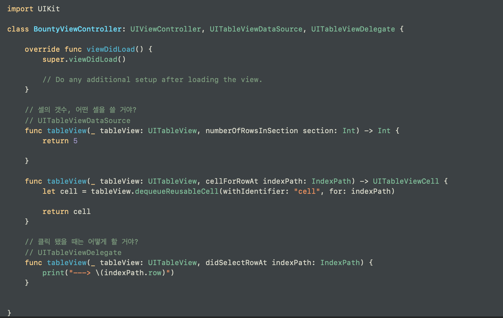
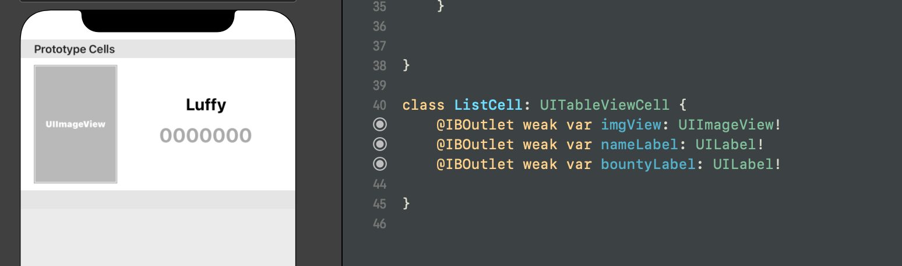

# 1. 프로젝트 생성
## AppDelegate
AppDelegate.swift 는 앱이 실제로 실행할 때 여기 있는 메소드들이 호출되는 것이다.
> 이번 앱 만드는 데에 있어서 목표는 테이블 뷰를 통해 아이템을 리스팅하는 것

## 2. ViewController 파일 새로 만들고,
스토리보드로 가서 연결시키고, 테이블 뷰를 만들고, 테이블 뷰에 대해서는 바로 오토레이아웃을 해주고! 그 안에 데이터가 리스팅 될 테이블뷰셀을 추가한다

## 3. TableView를 위한 Protocol
TableView 서비스를 이용하기 위해서는 셀의 갯수가 몇개인지, 어떤 셀을 이용해서 표현할 것인지 반드시 알려주어야 한다. 이를 위해 두 가지 프로토콜을 준수하여야 한다.
- UITableViewDataSource, UITableViewDelegate !

- 이번에는 Custom Cell을 만들 것이다.
    1. 스토리보드로 가서 셀을 커스터마이징한다.
        * TableViewCell 오브젝트의 Indentity Inspector로 가서 Class의 이름을 바꾼다.
        * 원하는 오브젝트들을 추가하여 꾸민다.
    2. 이 뷰컨트롤러에 해당하는 파일로 가서, 커스텀 셀의 프로퍼티들을 만들어준다.
        * class ListCell: UITableViewCell {} 로 만들었고, 이 ListCell이 해당 셀의 아이덴티티 인스펙터에 들어갈 이름이 된다.
        * 그리고 셀 내부를 꾸민 객체들에 맞게끔 변수들을 선언해준다. @IBOutlet weak. ...
        * 스토리보드의 각 객체들__*(UI Component)*__과 연결되어 있는 파일의 내부의 각 변수들을 연결시켜준다.
    