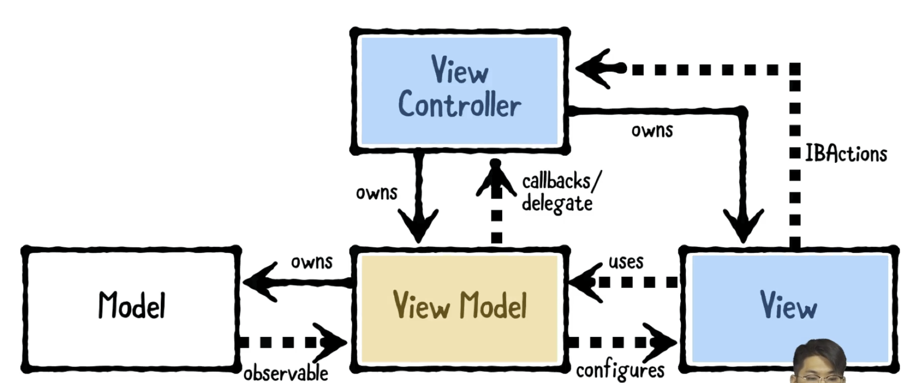

# Design Pattern
방에 옷 정리를 할 때도 저마다의 패턴(아우터, 티, 이너웨어 분류해서 하는 둥)이 있는 것처럼. 결국 디자인 패턴이란 코딩을 조금 더 잘 짜기 위한 패턴이다.
무작정 코드를 짜서 굴러가게만 만들어 놓으면, 유지 보수하는데에 비용이 너무 많이 들어간다.
결국 디자인 패턴이란 유지 보수하기 쉽게 고안해낸 전략이다. 이 중에 일반화되고 널리 알려진 것들이 MVC, MVVM 패턴이다.

디자인 패턴, 즉 Clean Code에 힘쓴 유명한 사람들 3명.
이들이 쓴 책도 좋다.

 
 

## Design Pattern's Goal
---

 
 

## 즉, 코드 구조에 대한 전략이다.
---
구체적으로 보자면, 어떻게 코드를 구조화 시킬까에 대한 전략이다.
1. Clean Architecture
2. Design Pattern

 
 

## MVC 
---
Model - View - Controller. 

현재 앱 개발 시 가장 많이 쓰이는 패턴은 MVVM이지만, 이전까지는 MVC 패턴이 널리 쓰였다. 

실제로 애플 개발 공식 문서에도 MVC 패턴을 장려했었다. 

(Model의 데이터는 가끔 Class이 될 수도 있음)

MVC 패턴에서, 개발을 하다 보면, 중계자 역할을 하는 UIViewController가 너무 많은 일들을 해야 할 때가 있다. 뷰 컨트롤러의 코드가 너무 길어지고, 기술 부채가 발생하는 현상을 목격. Massive View Controller라고 까내리기도 함.

 
 

## MVVM
---
Model - View - ViewModel

 
 

# MVC VS MVVM
MVC에서 MVVM으로 바뀌면서 갖게 된 특징
- UIViewController 가 Model에 직접 접근하지 못함
- UIViewController 가 ViewModel을 새로 갖게 됨
> 개선점: 오지라퍼 ViewController가 오지랖을 떨지 못하게!
>
> ViewController의 할 일을 ViewModel에게 많이 넘겼기 때문에, 할 일이, 역할이 축소되었다.
>
> 즉, __*UIVieWController가 하는 일이 조금 더 명확해졌다고 볼 수 있다.*__ 
>
> 이렇게 클래스가 하는 일이 명확해질 수록 수정이 더 용이하고, 유지 보수에 더 적은 비용이 들게 된다. 

 
 

# MVVM 실제 구현

## 개념 

  

## __*기존의 작성했던 코드에 대해 리뷰 후 수정[리팩터링]*__
---
리팩터링[코드 수정]: 기술 부채를 줄이고, 재사용 가능하게 하면서, 유지 보수 비용을 더 적게 들도록.

(사용자 입장에서는 앱을 이용할 뿐이니 변하는 게 없다. 그저 내부의 코드가 바뀌는 것일 뿐!)

  

## 리팩터링의 중요 원칙들
---
1. 중복 제거 -> 기술 부채 감소
2. 단일 책임 갖기 -> UIViewController가 오지랖을 떠는데, 이를 막아야 함. 작게는 method, 크게는 object 단위에서 단일 책임의 원칙을 지켜줘야 함.
3. 10, 200 rule -> method는 10줄 안에, class는 200줄 안에 작성하기
    + 초심자 버전: 30, 400 rule