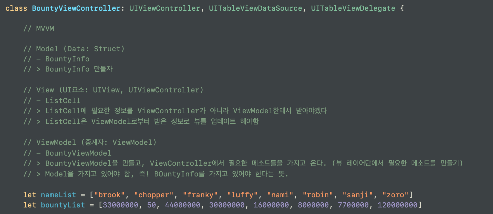
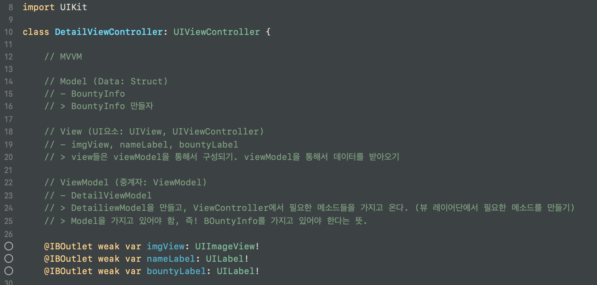
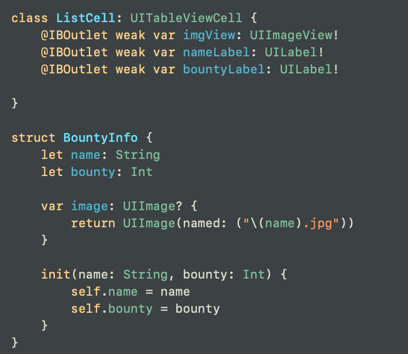
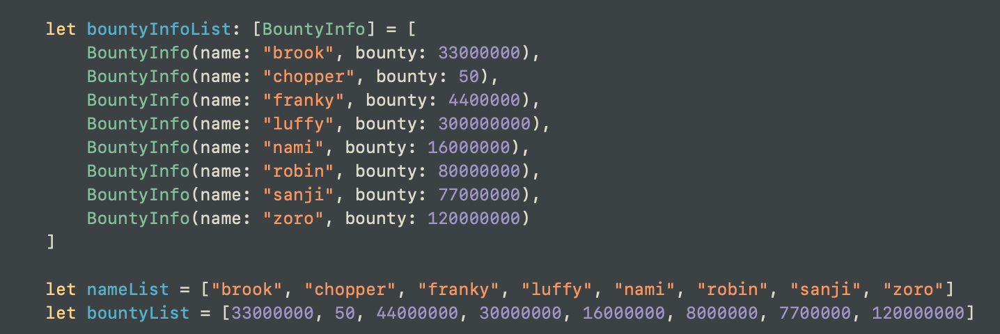
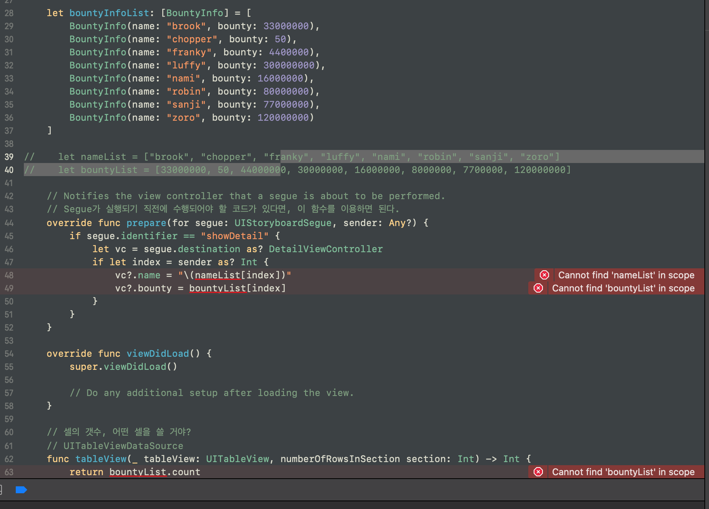
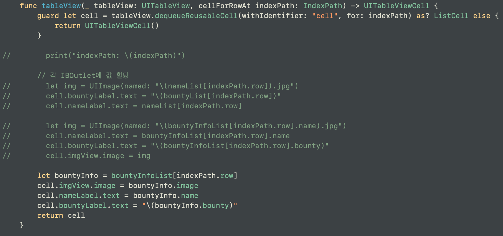
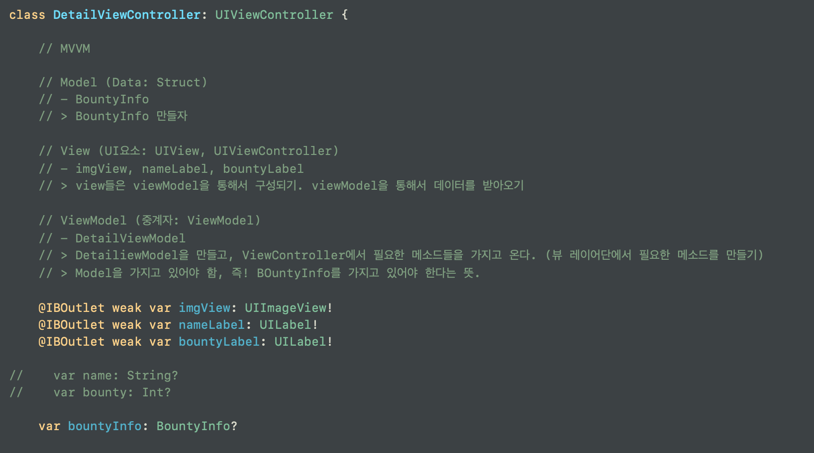
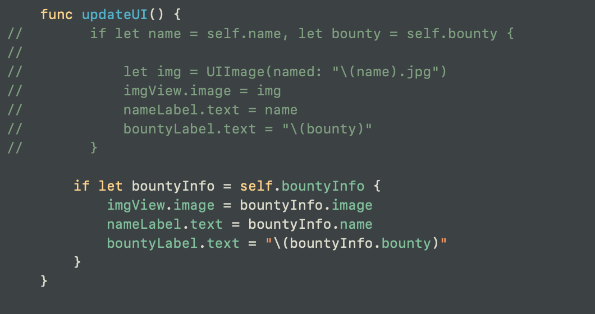
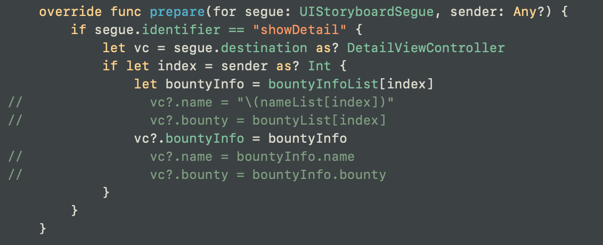

# Refactoring
- MVVM 모델에 맞추기 위해 Model, View, ViewModel 에 맞춰 분류한다.
- 그에 맞춰 코드를 짠다.
---
### __*"이번 파트는 제대로 필기를 못하겠다.. MVVM은 조금 시간이 걸릴 것으로 판단되어 영상만 2번 보고 넘어간다.. 다음에 다시 와서 보자."*__
---
 

> 들어가기에 앞서 한번 더 설명
> Model: 데이터 타입. ex) struct / class
>
> View: UI요소. UIView, UIViewController. ex) UITableVIewCell의 커스텀 셀 class ListCell. 이 커스텀 셀의 데이터 갱신을 뷰 컨트롤러에서 직접 하는 게 아니라 이 class ListCell 내부에서 진행할 것. 
>
> View Model: 중계자. 
> - Model의 내용을 View에서 사용할 수 있게끔 전환시켜 주는 역할을 한다.
> - 어떻게 쓰느냐? 클래스를 하나 만들고, 필요한 모든 과정을 ViewModel을 거치게끔 만들어서 View Model의 기능을 수행하게 만든다. class ViewModel {}
> - View Controller는 이제 모든 필요한 정보를 View Model한테 묻는다
> - __*Model이 사용하는 데이터 값을 실제로 가지고 있음*__ 

 

## 먼저 BountyViewController 로 간다
---

코드 리뷰 후, 어떻게 리팩토링 할지에 대해 적어본다. 

그 후에 하나씩 구현을 해본다.

우선, Model 파트부터!

다 했으면 DetailViewController로 가서 똑같이 해본다.

  

## Model
struct BontyInfo를 만들고 이 스트럭트를 이용해 데이터를 받아오도록 변경한다.

 

그 후에 원래 사용하던 코드를 주석처리 하고 빌드를 해본다. 

이떄 뜨는 에러들을 좇아가면서 하나씩 수정하면 된다.

 

코드를 고칠 때에는 최대한 스마트하게!

 

