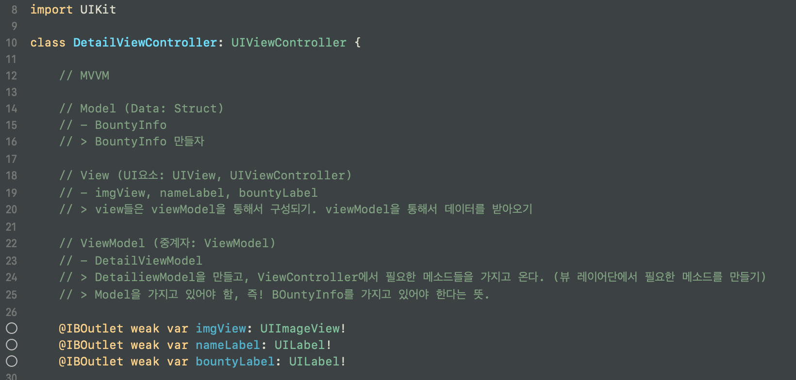
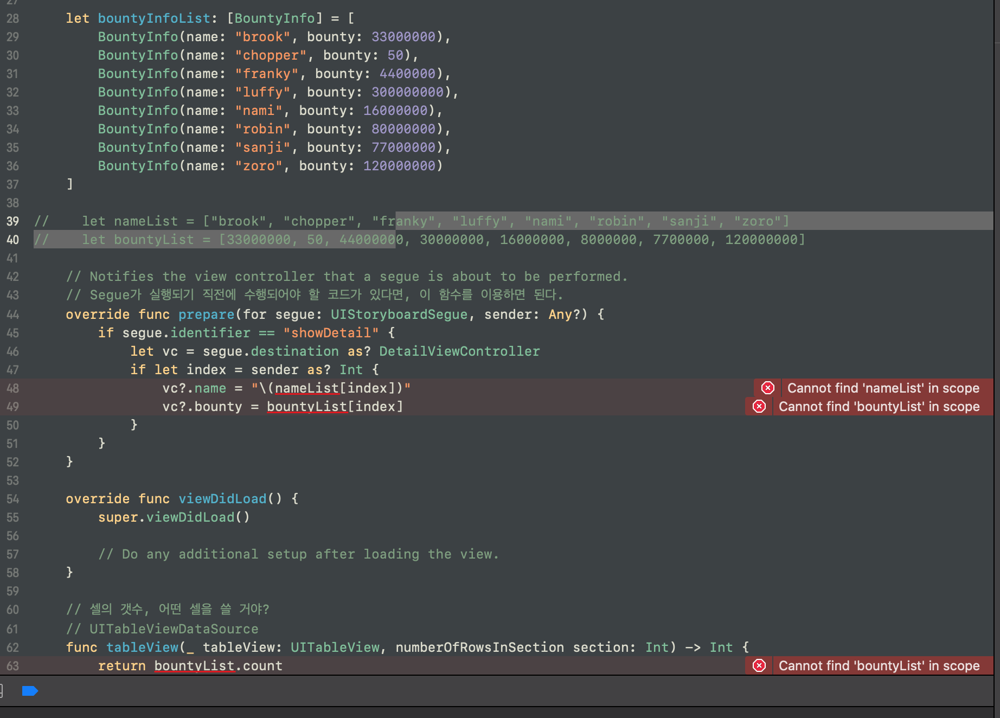
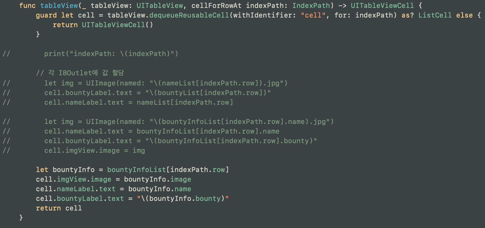

# Refactoring
- MVVM 모델에 맞추기 위해 Model, View, ViewModel 에 맞춰 분류한다.
- 그에 맞춰 코드를 짠다.

 

## 먼저 BountyViewController 로 간다
---

코드 리뷰 후, 어떻게 리팩토링 할지에 대해 적어본다. 

그 후에 하나씩 구현을 해본다.

다 했으면 DetailViewController로 가서 똑같이 해본다.

  

## Model
struct BontyInfo를 만들고 이 스트럭트를 이용해 데이터를 받아오도록 변경한다.

 

그 후에 원래 사용하던 코드를 주석처리 하고 빌드를 해본다. 

이떄 뜨는 에러들을 좇아가면서 하나씩 수정하면 된다.

 

코드를 고칠 때에는 최대한 스마트하게!
