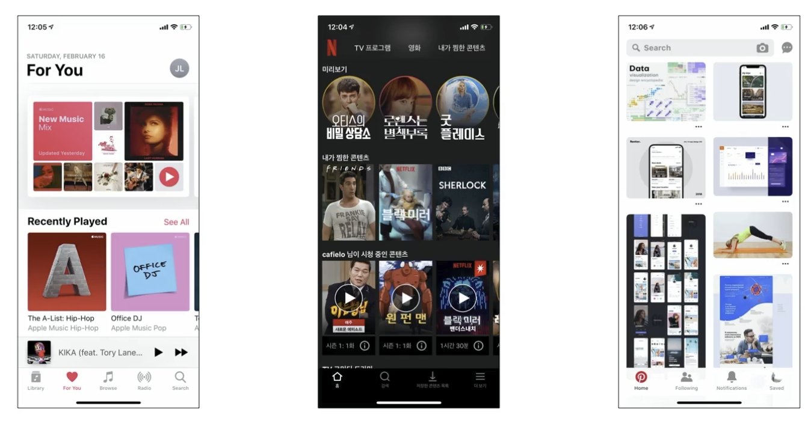
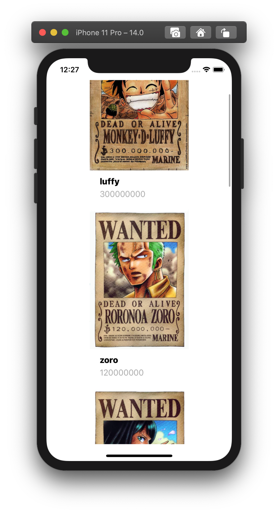

# CollectionView
한 행 안에서 여러 아이템을 보여주기 위해 사용한다.

(TableView는 Column이 한개. CollectionView는 Column이 여러개.)

TableView에 비해서 데이터의 나열이 매우 자유롭기에 많은 아이템을 보여주는 뷰에서는 컬렉션 뷰를 항상 고려하게 된다.

따라서 전에 만들었던 원피스 앱을 컬렉션 뷰로 담아볼 예정이다.

- UICollectionViewLayout: 레이아웃이 자유롭기 때문에 레이아웃을 관리해주는 긱체가 있다. 이를 이용해 커스텀할 수 있다.

- UICollectionViewFlowLayout: 이 객체는 애플이 제공해주는 기본적인 레이아웃을 만들 때 쓰인다.
- DataSource & Delegate 테이블 뷰에서 사용했던 이 패턴을 그대로 사용할 것이다.
- Protocol

---

  

## 먼저 스토리보드로 가서 이전의 테이블 뷰를 지운다.
그 후에 컬렉션 뷰를 넣고, 오토레이아웃을 하고, 그 안에 UI컴포넌트들을 추가한다. [컬렉션 뷰 커스터마이징]

그리고 UICollectionView가 질문을 할 ViewController를 꼭 연결해줄 것 ㅋㅋ

 

## 이제 코드로 간다.
Table View를 사용하기 위해서 했던 과정과 같다.
Data Source Protocol을 준수하기 위해 필요한 함수 두개를 구현한다.

셀 몇개야? 셀을 어떻게 보여줄까? (어떤 셀을 써서, 그 셀 안의 데이터는 어떻게?)

그 후에 추가로, __*필요하다면*__ 셀이 클릭되었을 때 어떻게 할지, 컬렉션의 흐름을 어떻게 보여줄지 설정해주면 된다.

위와 같이 작성을 하고 실행을 시켜 보면

컬렉션 뷰가 이런식으로 구성됨을 알 수 있는데, 우리는 한 행에 여러 열을 두고 싶은 것이기 때문에. (열 하나만 두고 싶으면 테이블 뷰 쓰면 됨.)

추가로 설정을 해주어야 한다.

 

## UICollectionViewFlowLayout
---
적당한 선에서 제어하고 싶으면 애플이 제공해주는 디폴트 값에 가까운 UICollectionView __*Flow*__ Layout을 사용한다.

그게 아니라 완전히 커스텀하고 싶으면, UICollectionViewLayout을 사용한다.

> class UICollectionViewFlowLayout : UICollectionViewLayout
