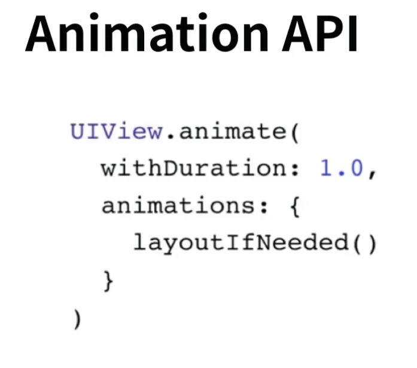
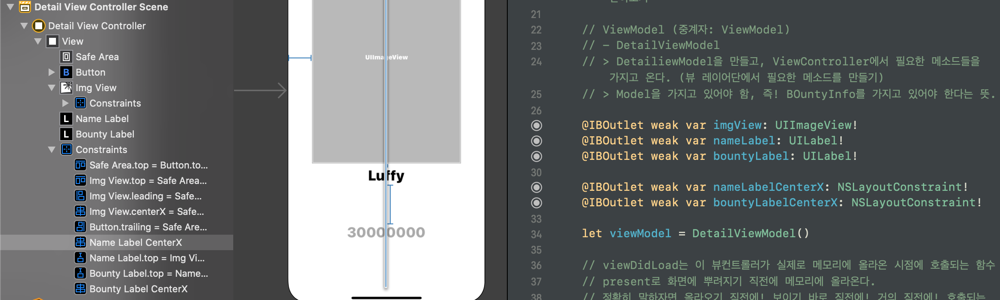
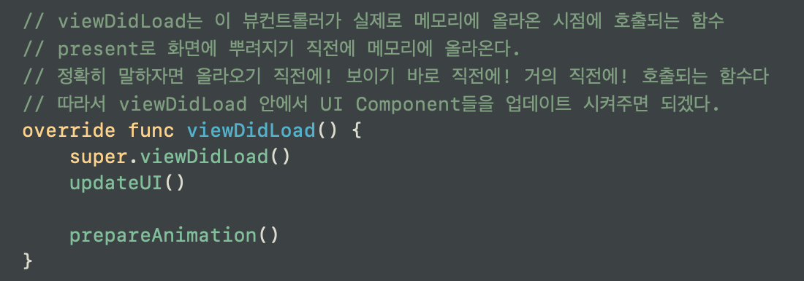
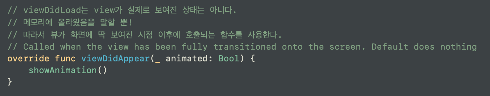
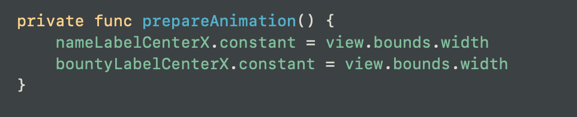
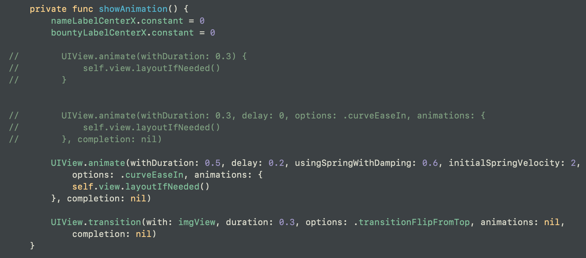
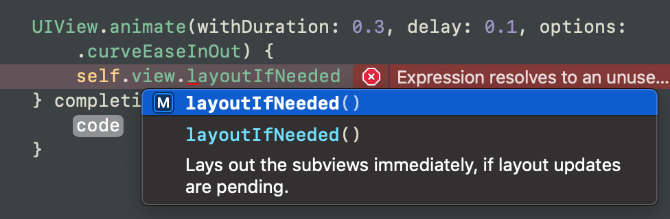

# Animation
◼️ 시간에 따라 뷰의 상태가 바뀌는 것을 말한다.

> __*애니메이션의 3요소: 시작, 끝, 시간*__

 
 withDuration: Animation이 진행되는 시간

 animation: {}: Animation Closure. 애니메이팅 시킬 녀석들이 들어갈 자리.

 어떤 객체의 x값을 두고, 시작점과 끝점을 둬서 이동하게 할 수도 있고.

 꼭 뷰(뷰의 프로퍼티)가 아니라 뷰를 둘러싸고 있는 오토레이아웃을 하는 Constraints 에 대해서도 애니메이팅 할 수도 있다.

Animating 가능한 View의 속성들에 대해 알아보자.

 

---

 

> 우리가 만든 앱에서는 프리젠트 모달리로 띄우는 두번째 뷰 컨트롤러 안에서 각 UI 요소들에 대해 애니메이션을 추가할 것이다.

 

## 1. 레이블에 대한 에니메이션
- 레이블은 화면의 오른쪽 바깥에서 들어오는 애니메이션을 추가할 것이다.

- X 좌표를 건드릴 것이다. X 좌표에 해당하는 Constratint를 찾아서 @IBOutlet 변수를 만든다.

- 

 

- 애니메이션이 진행되는 시기는 뷰가 화면에 뿌려진 뒤이다. -> viewDidAppear() {} 안에 구현. 

- 애니메이션을 준비하는 시기는 뷰가 화면에 뿌려지기 직전. 메모리에 올라온 상태이므로 -> viewDidLoad() {} 안에 구현.

- 
- 
- 
- 

- UIView.animate를 통해서 화면에 애니메이션을 추가했다.
    + 시간만 조절하는 간단한 함수부터, 딜레이 및 가벼운 옵션을 주는 함수, damping을 추가하는 함수까지 다양하게 있다.

- self.view.layoutIfNeed() 호출
    + 레이블의 x 값, 즉 레이아웃 제약조건을 건드리는 것이기 때문에 레이아웃이 변하는 것이다. 따라서 레이아웃이 변할 경우 UIView.animation(.......) 내부에 animation에 레이아웃이 변하기 때문에 새로 레이아웃을 해야한다고 알려주어어야 함.

 

- 

