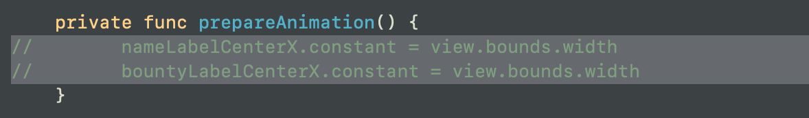
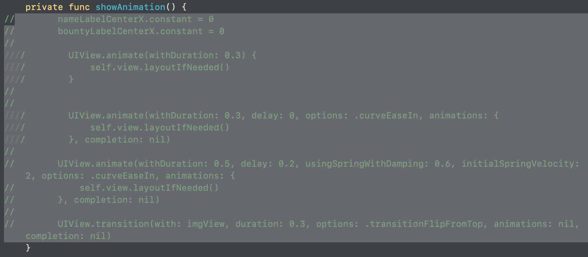
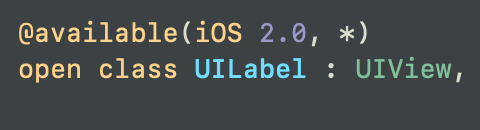
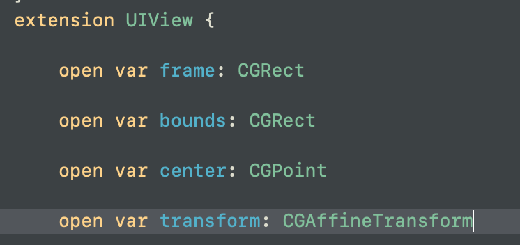
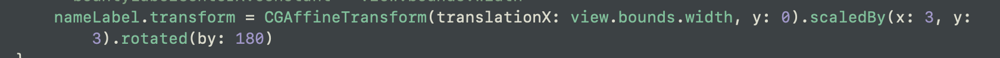
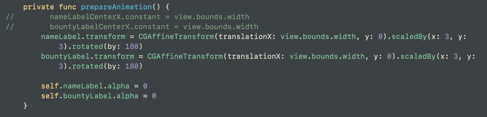
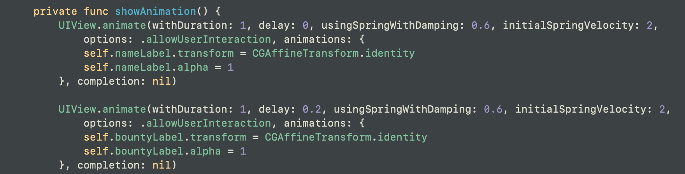

> 저번 시간에는 오토레이아웃의 제약조건의 컨스턴트로 애니메이션을 만들었다.
>
> 이번 시간에는 뷰의 속성을 직접적으로 이용해서 (뷰의 프로퍼티를 가지고) 애니메이션 하는 방법에 대해 알아볼 것이다.    

 

# 애니메이팅할 수 있는 뷰의 세가지 카테고리.

1. Position & Size: bounds(한계), frame(틀), center(중심)
    + 오토레이아웃과 겹칠 수 있는 아이들이기 때문에 잘 써야한다.
    + UIView.animate를 통해 애니메이팅을 해놓았는데, 또 값이 건드려질 수가 있기 때문이다.
    + ex) 오토레이아웃 범위를 넘어가도록 애니메이션을 주면, 나중에 원래의 오토레이아웃 값으로 돌려지는 수가 있다.
2. Transformation: rotation(회전), scale(크기), translation(위치)
3. Appearacne: backgroundColor(배경색), alpha(투명도)

 

# 실제로 한번 해보자.
## 1. 먼저 기존에 제약조건과 관련된 변수들을 지운다.

 

## 2. 수정할 각 UI요소의 Property에 접근한다. 
- 이때 UILabel은 UIView의 서브클래스이므로, UIView 의 프로퍼티를 사용할 수 있다. 
    + UIView의 프로퍼티인 transform: CGAffineTransform을 사용해서 위치를 변경할 것이다.

## 3. 

이렇게 .뒤에 바로 함수 호출이 가능한 이유는 반환 타입이 자기 자신이어서 그렇다.

 

UILabel들의 transform 프로퍼티를 사용하면 손쉽게 애니메이팅이 가능하다.

cf. self.view.layoutIfNeed() 은 오토레이아웃의 제약조건을 이용해서 할 때만 해주면 된다.