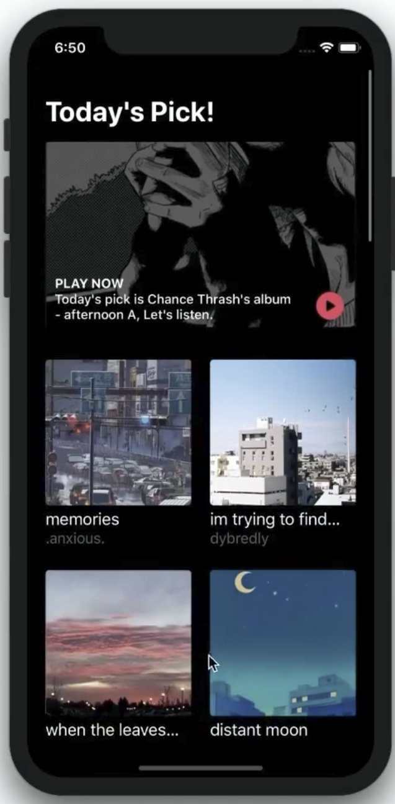
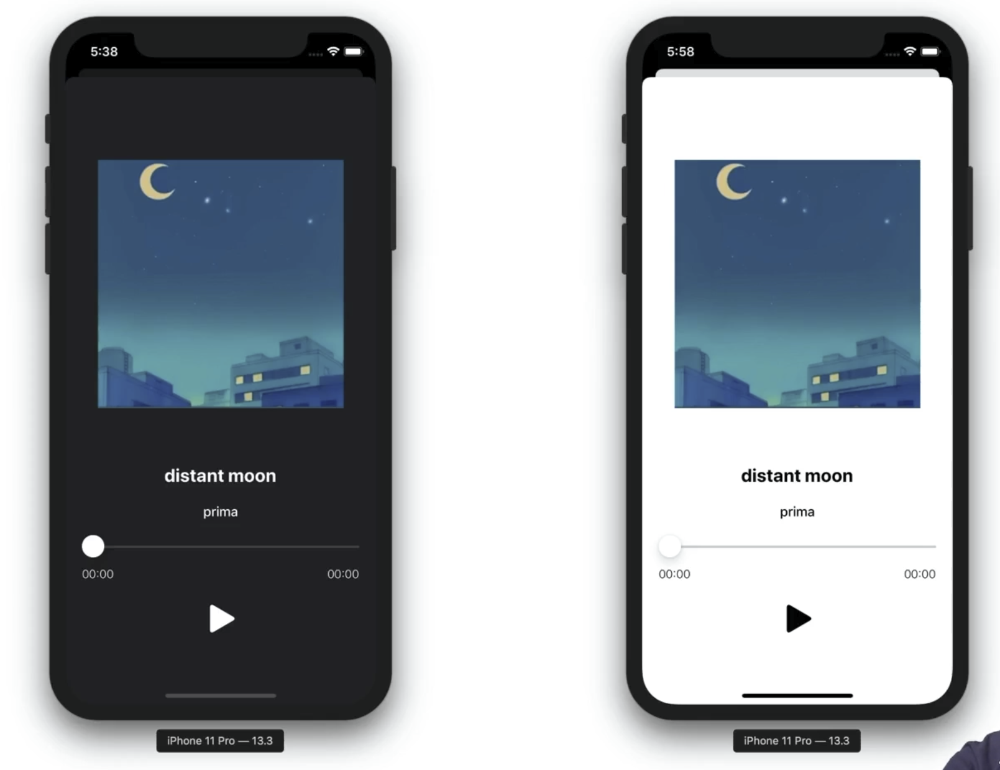

# 구현 계획
## 1. AVFoundation
음악 재생을 포함한 모든 미디어 작업[카메라, 비디오, 음악 스트리밍)을 할 때에 사용하는 프레임워크
(공구함 같은 것)
(UIKit은 UIView를 구성하기 위한 프레임워크)

- AVPlayer
    + 미디어를 플레이어 시켜주는 객체
    + 재생 및 정지, 슬라이드를 이용한 구간 seeking 등
- Dark Mode
    + iOS13 이후 다크 모드에 대한 대응이 중요해짐
- CollectionReusableView(섹션헤더뷰)
    + 여러 아이템들을 표현할 때 아이템들의 헤더, 푸터를 표현할 수 있다.

