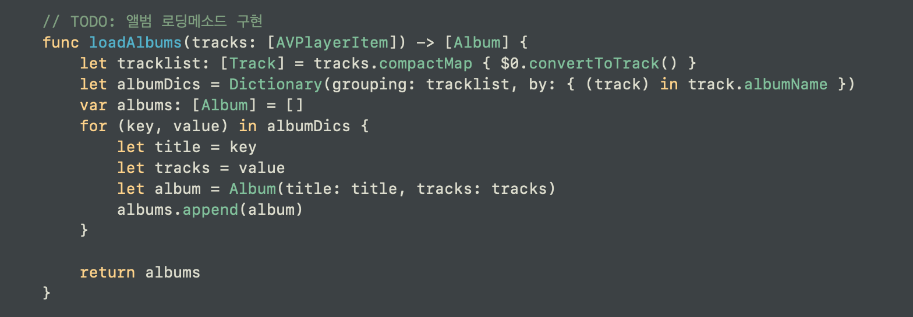

# AVPlayerItem 생성 및 실제 사용할 데이터 타입으로의 변환
- 음악 파일이나 미디어 파일을 가져올 때 쓰는 객체이다. 

- 이 객체는 생성 시 url 혹은 AVAsset을 필요로 한다.

- 내가 공부한 예제에서는 url을 사용했다.
    + url을 사용할 때에는 내가 작업 중인 프로젝트의 전체 Bundle 안에서도 main 그 안에서 urls !
    + Bundle.main.urls(forResourcesWithExtension:subdirectory:) 을 이용하는데,
    + forResourcesWithExtension은 내가 가져올 파일이 포함하고 있는 걸 토대로 가져온다. "mp3" 처럼.
    + 이렇게 가지고온 결과물은 [URL]? 이다. 가볍게 닐 퀄리싱을 해준다. 결과물이 nil 일 시에는 깡통 반환!
    + 가지고 온 url을 토대로 [AVPlayerItem]을 만든다. 
    + [AVPlayerItem]으로 만드는 이유는, mp3 확장자를 가지고 있는 모든 파일들을 한번에 묶어버리기 위함.
    + 이 때 사용하는 것은 고계 함수의 map. Array는 고계 함수를 가지기 때문에 map 사용이 가능하다.
    + map과 url을 사용해서 [AVPlayerItem]을 만든다.
    + 만든 [AVPlayerItem]을 반환한다.
    

- 이제 만든 [AVPlayerItem] 을 가지고, 내가 원하는 형태로 데이터를 가공하면 된다.
    + 일단 [AVPlyaerItem] 을 [Track] 형태로 바꾼다.
    + 이 [Track] 은 그냥 데이터의 나열이다. 여기서는 앨범 이름을 기준으로 묶어보았다.
    + 이 과정에서 Dictionary 타입의 형태를, 힘을 빌린다.
    + Dictionary 의 형태를 거쳐서 최종적으로 원하는 [Album] 을 만들어낸다.
    

- 원하는 인덱스의 Track을 추출해내기 
    + index 를 받아서, 만들어져있는 데이터 타입 [Track]을 이용해 해당 인덱스의 값을 추출한다.
    

- 오늘의 트랙을 뽑아주기(랜덤 형식)
    + 
    

  

---
- asset:AVAsset 프로퍼티를 가지고 있다.

