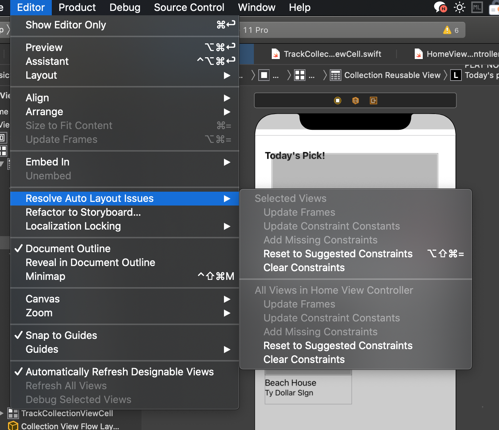

# viewForSupplementaryElementOfKind
collectionView(_:viewForSupplementaryElementOfKind:at:)

Asks your data source object to provide a supplementary view to display in the collection view.

강의에서는 헤더뷰라고 하였으나, 이는 Supplementary View인듯 하다. 이 뷰가 Header / Footer 가 되는듯.

 

---
## ◼️ 이 함수를 사용하기 위해서 이 함수에 어울리는 UIComponent를 추가한다.
> UI Component we need: __*Collection Reusable View*__

 

이를 추가할 때에는 뷰컨트롤러 위로 드래그하는 것이 아니라 카테고리 목록으로! 컬렉션 뷰와 셀 사이에 잘~ 놓는다.

헤더뷰이기 때문에 기존의 셀 보다는 상단에 드가야하기 때문!

 

## ◼️ 헤더뷰를 추가했으면, 그 안을, 필요로 하는 UI Component로 꾸며준다.

 

## ◼️ 다 꾸몄으면 이 헤더뷰에 해당하는 클래스 파일과 연결시켜준다. (테이블뷰 셀, 컬렉션뷰 셀처럼. 헤더"뷰"일 뿐!)
UI Component 와 Class file을 연결시킨 후 클래스의 아웃렛 변수들을 각 UI요소들에 연결해준다.

그리고 이 셀이 탭 되었을 때, Touch Up Inside 상황에서 특정 기능을 수행하게 만들기 위해서 이미지 뷰 위에다가 UI Button 을 만든다. 이 버튼은 생성 후 투명하게 만들어서 전체 화면에 덮어둔다.

그리고 이 버튼에 터치업인사이드 조건으로 함수를 하나 연결시킨다.

이때 버튼의 위치가 왜 이미지 뷰 아래에 있는 건지 모르겠으나, 이건 작동 중에 위에 가야할지 아래로 가야할지 테스트를 해볼 예정이다. 어느 곳에 위치하여도 상관없다면.. 뭐 상관없겠지. 인강에서 강사님은 버튼을 굳이 이 위치에 두셨는데, 이유가 있지 않을까 생각해본다.

 

## ◼️ collectionView(_:viewForSupplementaryElementOfKind:at:)

뷰 컨트롤러 내부에 있는 collectionView(_:viewForSupplementaryElementOfKind:at:) 이 함수를 채우기 위해서는 해당 헤더뷰와 연결된 클래스 내의 함수 역시 채워줘야 한다.

> 헤더뷰에는 "오늘의 추천곡"을 띄울 예정.

헤더뷰 클래스 내부에 값을 업데이트 할 함수와 버튼이 클릭되었을 때 할 함수를 구현한다.

여기서 update(item:) 만을 사용해서 데이터 값을 채워놓으면, 헤더뷰의 화면은 완성된다.

그러나, 우리가 최종적으로 하고 싶은 것은 헤더뷰를 클릭했을 때(헤더뷰 위의 숨겨놓은 버튼을 눌렀을 때) Player 를 띄우는 것이다.

이를 위해 cardTapped 함수 내에 클로저로 선언해두었던 tapHandler에 item을 끼워서 넘긴다.

그러니까, 버튼이 탭 되었을 때! 이 헤더뷰를 구성하는 뷰 컨트롤러 내에 있는 함수에서, 이 tapHandler 의 클로저 부분을 구현하면 된다.

item을 넘겨서 왔기 때문에, 그 item을 가지고 player를 구성하면 아주 간단하다.

근데! 이 Player는 아직 구현이 안되어 있기 때문에 구색만 갖추어두고 넘어간다.

셀을 구현할 때 썼던 dequeueReusableCell(withReuseIdentifier:for:) 함수와 비슷하다.

헤더뷰는 SupplementaryView 를 상단에 갖다놓은 것이므로 하단에 갖다놓으면 푸터)! dequeueReusableSupplementaryView(ofKind:withReuseIdentifier:for:) 함수를 사용하면 된다.

아주 간단~하다.

  

---
__[TIP]__ 쉬프트 옵션 커맨드 = 누르면 해당 오류를 해결하기 위해 자동으로 컨스트레인트를 추가한다.

Editor - Resolve Auto Layout Issues - Reset to Suggested Constraints

 

