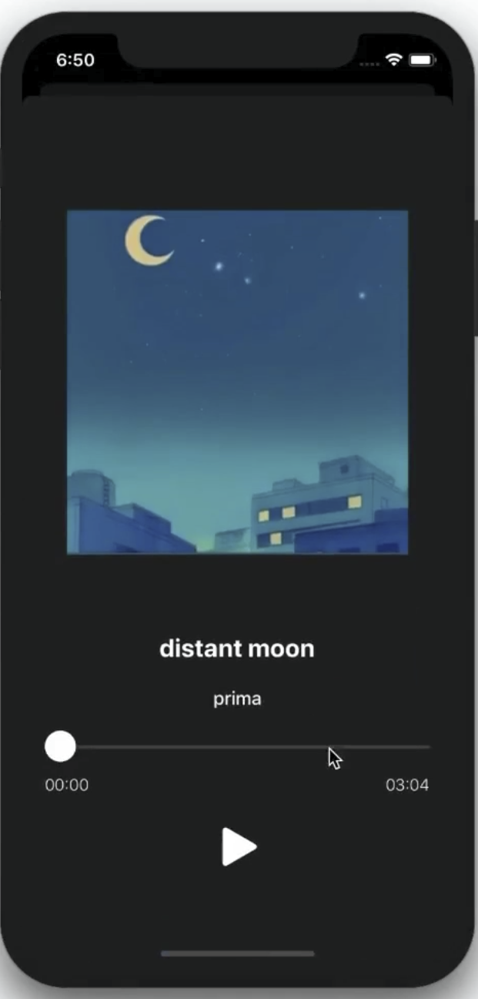
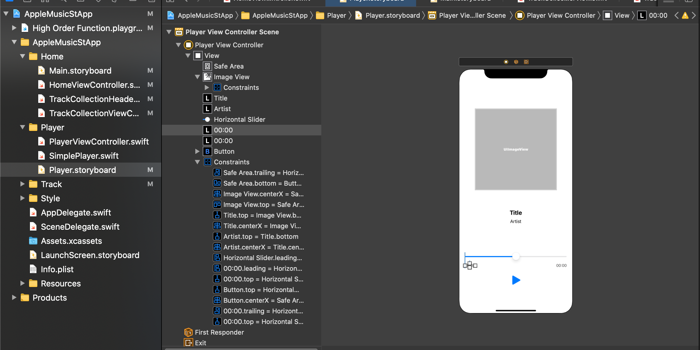

# Player (add View Controller)
◼️ 기존의 스토리보드에 이 뷰컨트롤러를 추가하지 않고, 새로운 스토리보드 파일을 만든 이유? 

스토리보드 안에서 여러 뷰컨트롤러가 있고, 이 뷰컨트롤러들이 서로 협업을 할 때. 

각자의 뷰컨트롤러에 대한 코드를 짜고, 합치려고 할 때. conflict이 나는 경우가 꽤 많다.

그래서 스토리보드의 뷰컨트롤러를 최소화하는 방향으로! (뷰컨트롤러의 숫자를 줄이고, 세그웨이를 줄이는 방향으로.)

최대한 잘게 쪼개자는 입장에서, 스토리보드와 뷰컨트롤러를 새로 만들 때 따로 만들어주는 것도 괜찮을 것 같다!

[from 이준원 강사님]

  

◼️ 하는 일? 

곡의 정보와 재생 관련 정보를 보여준다.

실제 재생 및 정지를 한다. (runtime 정보를 받아서 슬라이더가 실제로 움직인다.) 

노래 재생 시간을 알려준다. 등등

)

  

이제 만들어보자.

새로운 storyboard 를 생성하고 UI Component를 추가한다. 오토레이아웃을 마친다.

해당하는 클래스 파일을 채우러 간다.

우선 해당 아웃렛 변수들을 연결한다.

이번엔 하단의 플레이버튼을 아웃렛변수로 선언했네? 액션을 취할 필요가 없나보다.

