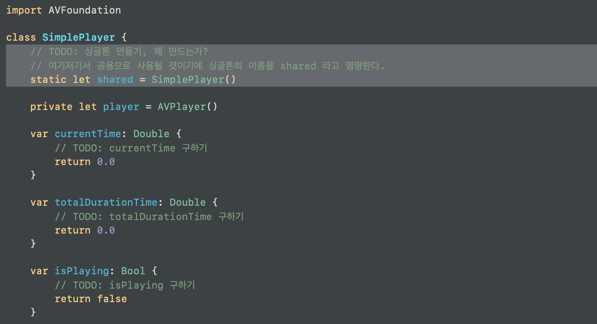
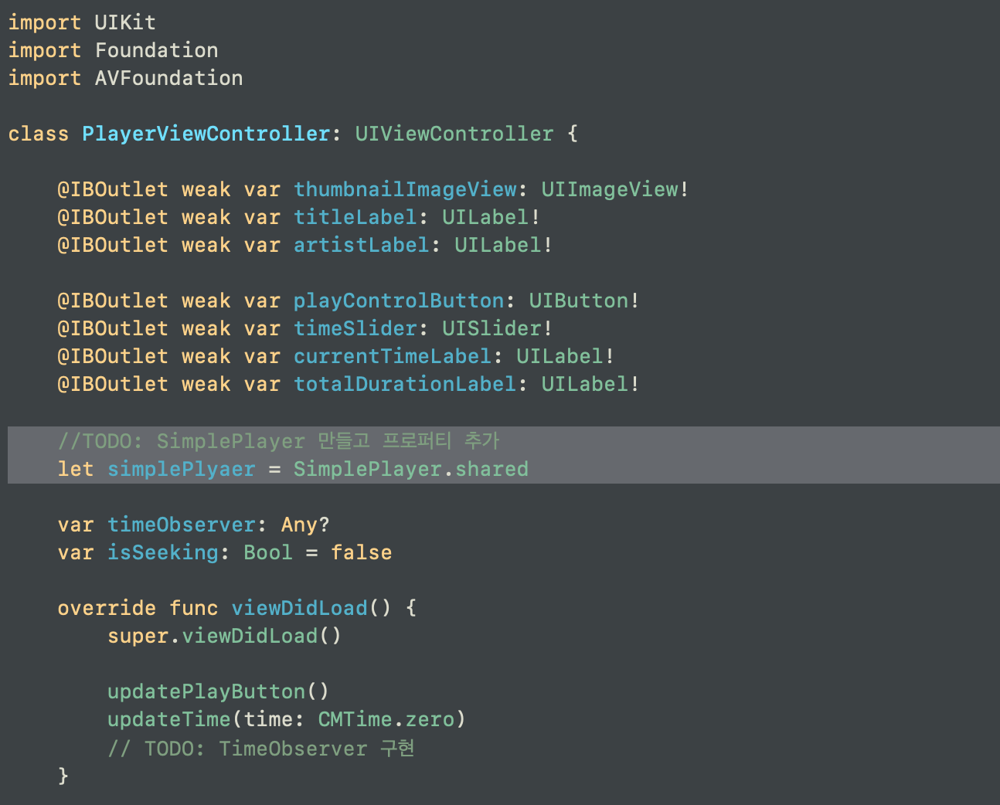
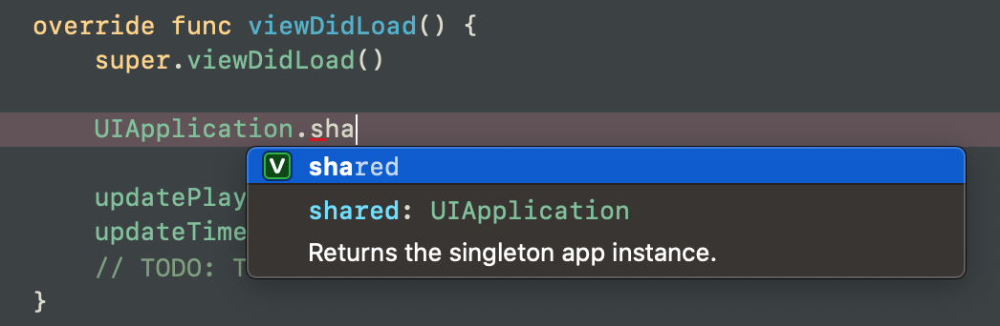
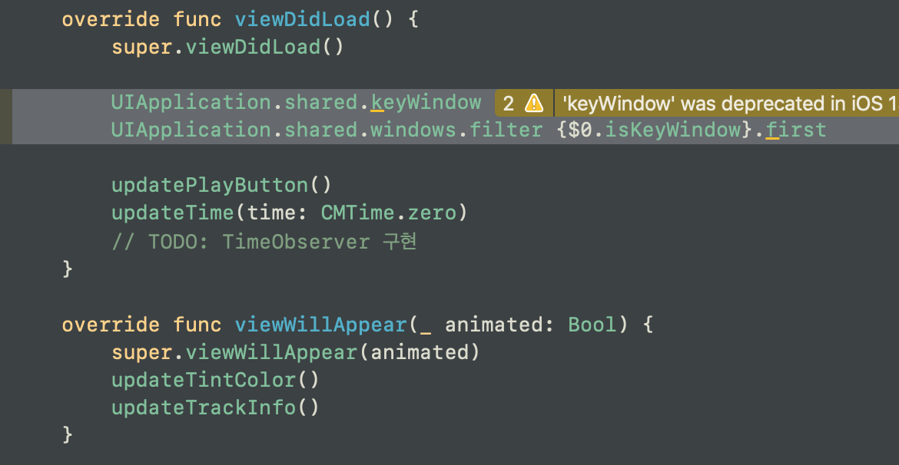
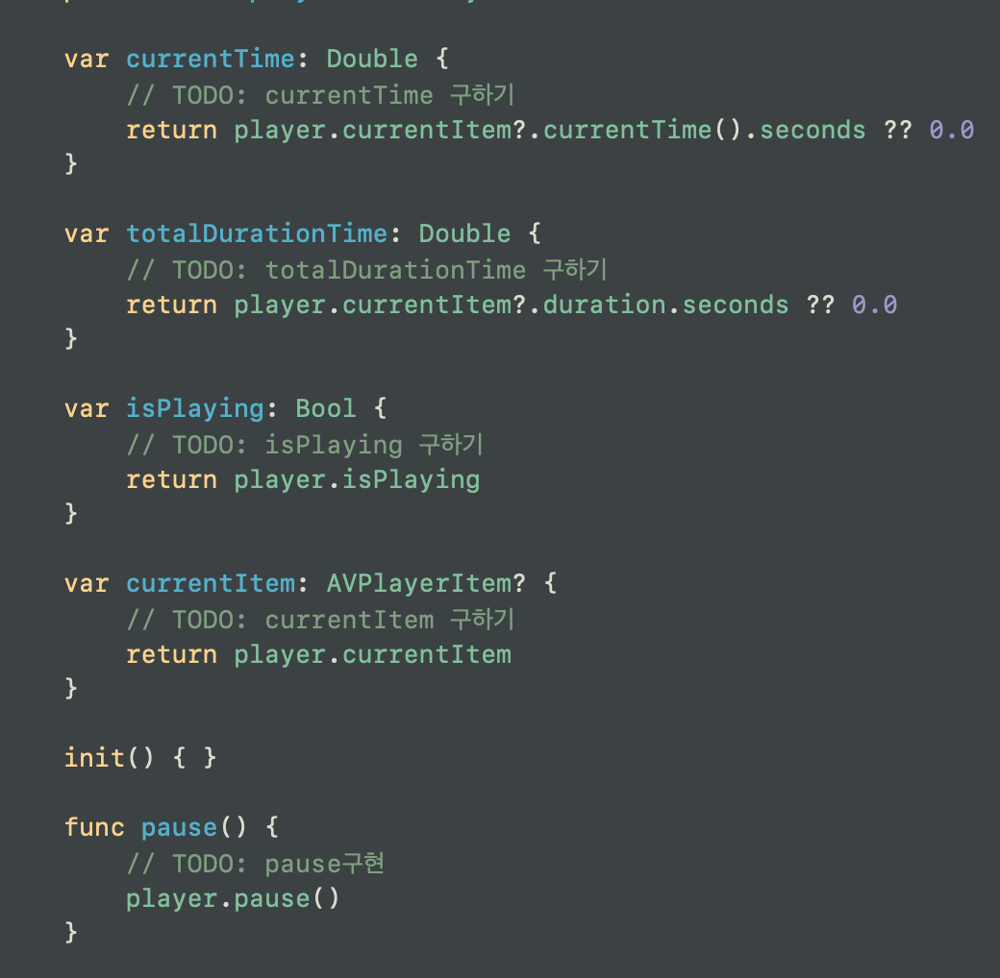
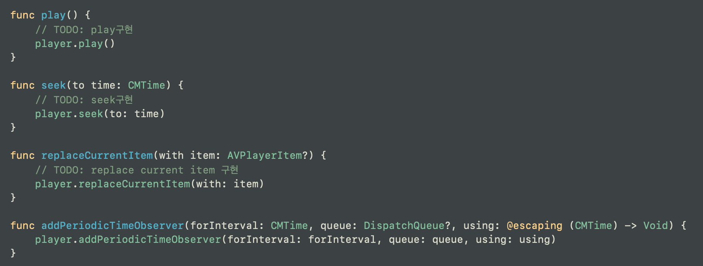

# 플레이어뷰의 플레이어 만들기 (Simple Player)
◼️ 하는 일 ?

현재 재생 중인 시간, 노래의 전체 시간, 현재 플레이 중인가, 현재 재생되는 아이템은 무엇인가 등을 가지고 있는 객체
> 실제로 재생화면에서 View 적인 측면이 아니라 실질적으로 작동하는데에 사용되는 객체다.

<br>

◼️ 싱글톤이란?

앱 내에서 하나만 필요하고, 필요할 때마다 여기저기서 불려서 사용되는 객체를, 싱글톤 객체라고 한다

이 Simple Player를 싱글톤으로 만들려고 한다.

<br>

◼️ 싱글톤은 어떻게 만들어지는가?

static 키워드를 사용해서 자기 자신의 객체를 선언한다. 자기 자신 안에서.



<br>

그 후 이 객체를 사용할 곳에서 가져다 쓰면 된다.


<br>

앱 내에서도 앱을 대변하는 객체가 딱 하나 있다. UIApplication이라고 함.



<br>

# Simple Player 내부
실제 재생하는 것에 관련되는 것들은 AVPlayer 클래스를 이용한다.
> AVPlayer Summary: An object that provides the interface to control the player’s transport behavior.

```
import AVFoundation

class SimplePlayer {
    // TODO: 싱글톤 만들기, 왜 만드는가?
    // 여기저기서 공용으로 사용될 것이기에 싱글톤의 이름을 shared 라고 명명한다.
    static let shared = SimplePlayer()
    
    private let player = AVPlayer()

    var currentTime: Double {
        // TODO: currentTime 구하기
        return player.currentItem?.currentTime().seconds ?? 0.0
    }
    
    var totalDurationTime: Double {
        // TODO: totalDurationTime 구하기
        return player.currentItem?.duration.seconds ?? 0.0
    }
    
    var isPlaying: Bool {
        // TODO: isPlaying 구하기
        return player.isPlaying
    }
    
    var currentItem: AVPlayerItem? {
        // TODO: currentItem 구하기
        return player.currentItem
    }
    
    init() { }
    
    func pause() {
        // TODO: pause구현
        player.pause()
    }
    
    func play() {
        // TODO: play구현
        player.play()
    }
    
    func seek(to time: CMTime) {
        // TODO: seek구현
        player.seek(to: time)
    }
    
    func replaceCurrentItem(with item: AVPlayerItem?) {
        // TODO: replace current item 구현
        player.replaceCurrentItem(with: item)
    }
    
    func addPeriodicTimeObserver(forInterval: CMTime, queue: DispatchQueue?, using: @escaping (CMTime) -> Void) {
        player.addPeriodicTimeObserver(forInterval: forInterval, queue: queue, using: using)
    }
}
```

