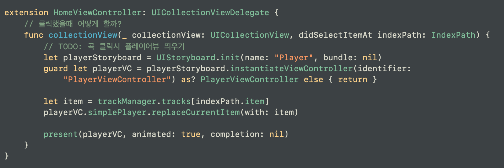
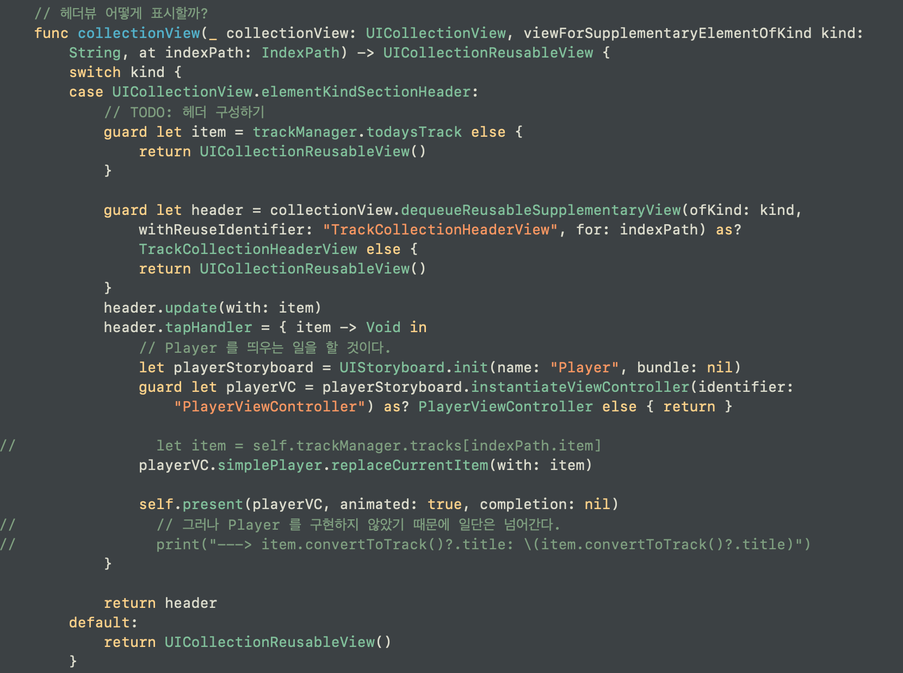

# 플레이어 뷰 컨트롤러 띄우기
전에는 한 스토리보드에 세그로 연결해서 performSegue로 구현하였으나, 이번에는 스토리보드 파일을 따로 생성했으므로, UIStoryboard 객체를 하나 생성한다.

이때, 아까 생성했던 싱글톤 객체에 데이터 값을 넘겨주면 된다.

그 후 present(_:animated:completion:) 를 사용한다.

일반 컬렉션 뷰 셀에서도 띄울 것이고, 상단에 헤더뷰에서도 띄울 것이니 두 군데에서 present를 해준다.

