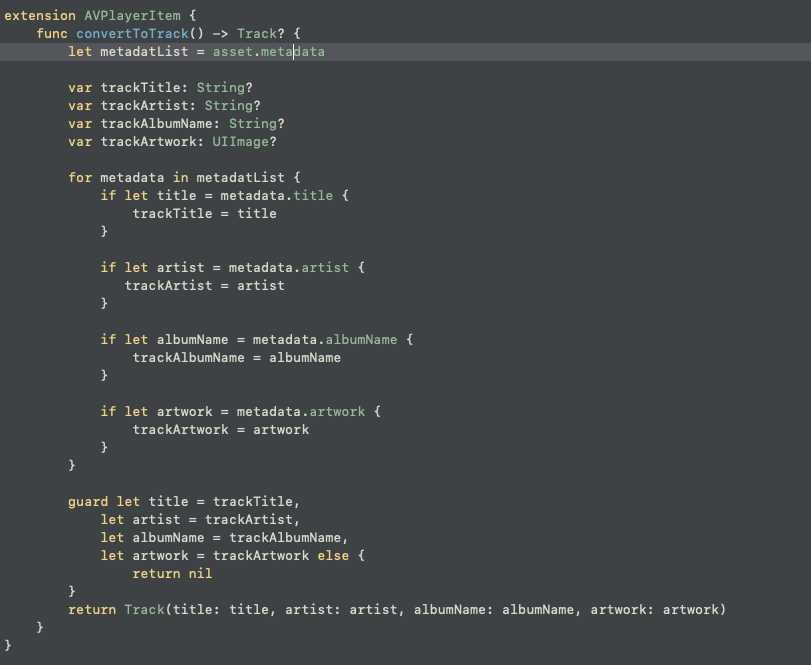
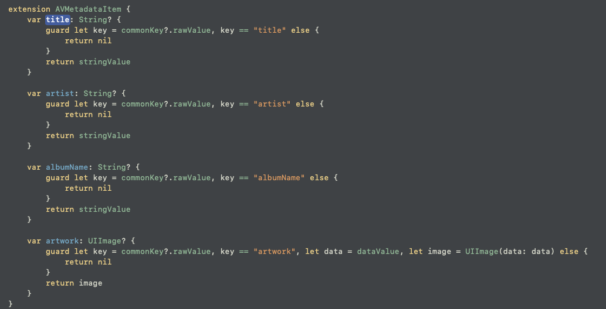
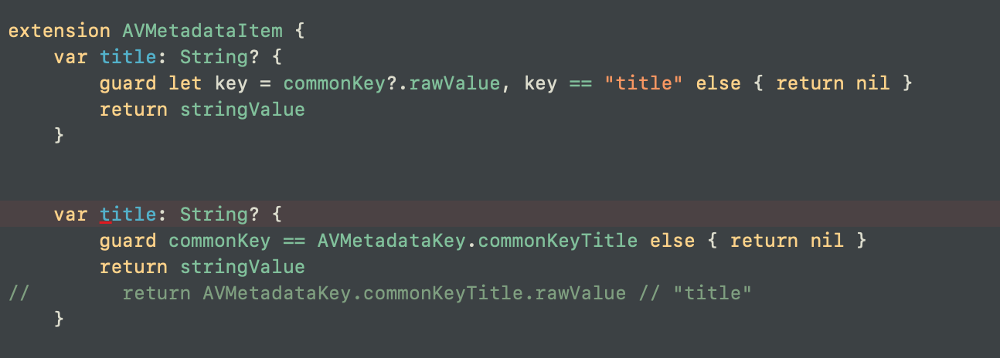
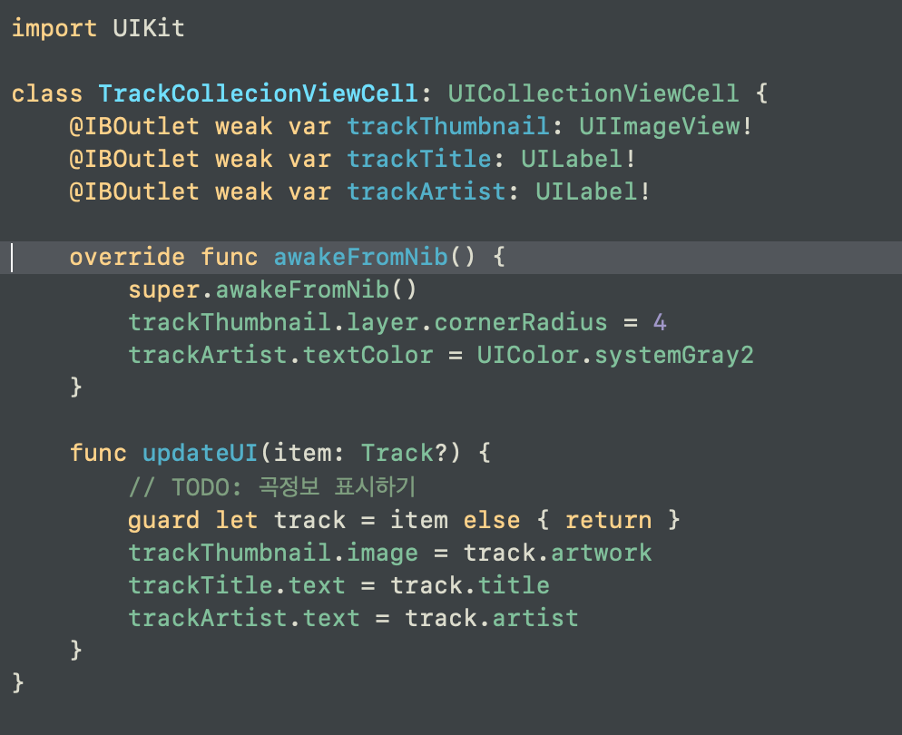
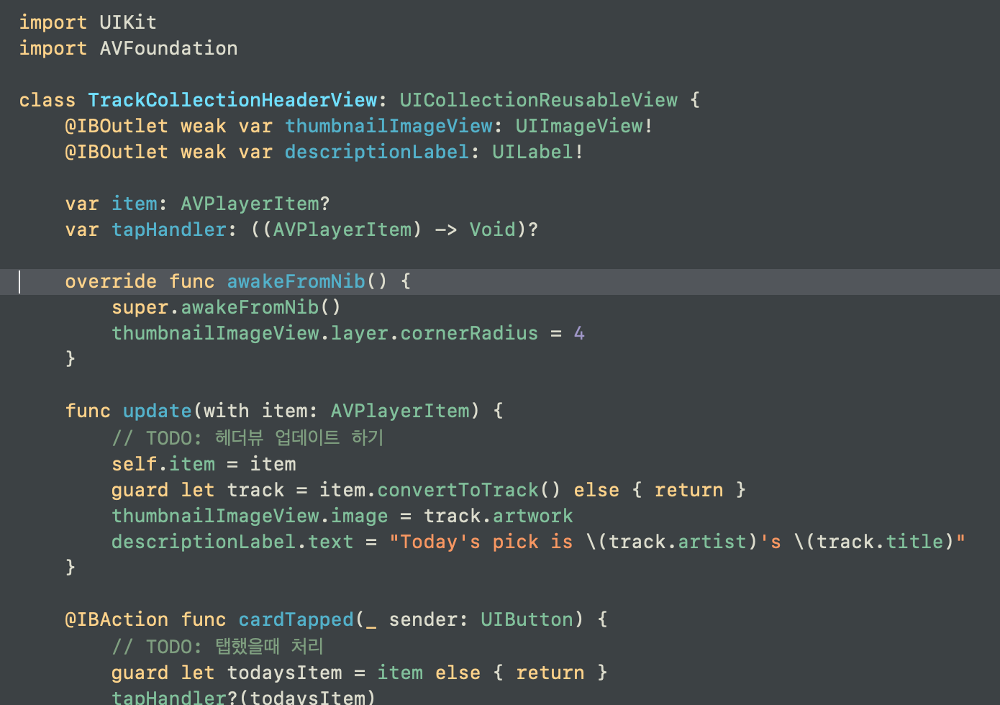
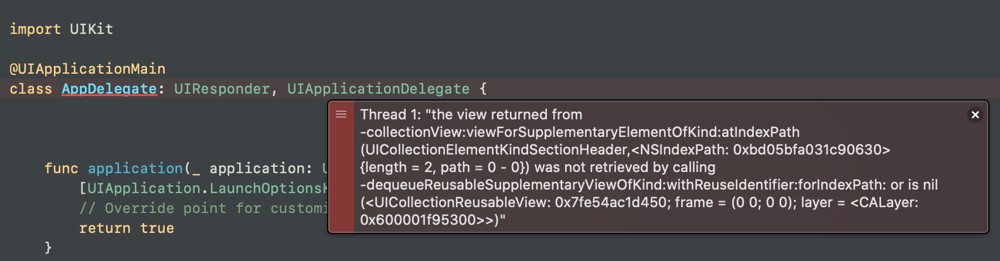
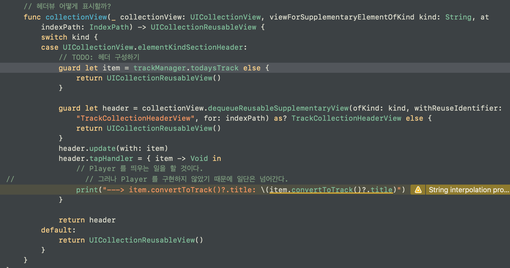
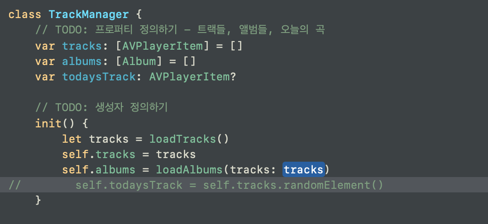

# AVPlayerItem 로부터 우리가 원하는 데이터 추출할 때 asset을 사용한다.
AVPlayerItem 내부에는 asset 이라는 프로퍼티가 있다.
이 asset 안에는 metadata 가 있다.
mp3 파일이 있을 때, 음원 정보 뿐만 아니라 metadata 가 같이 들어있는 것이다.
음원의 아티스트, 타이틀, 썸네일 등의 metadata(정보)가 들어있다.
url을 통해 AVPlayerItem을 만들어준 후에 이 만들어진 AVPlayerItem 을 가지고 우리가 원하는 데이터 모델로 변환시키는 작업을 extension AVPlayerItem {} 에다가 구현하는 것이다.

> AVPlayerItem 안에 있는 medata 정보(타이틀, 아티스트, 앨범, 썸네일 등)에 접근하여,
>
> 우리가 원하는 데이터들을 저장하고,
>
> 이 저장한 데이터들로 우리가 원하는 데이터 모델을 인스턴스화 시켜주면 된다.
>
> 이때 asset.metadata 값은 [AVMetadataItem]이다.
>
> 각각의 AVMetadataItem 에 대하여도 extension 으로 우리가 원하는 값들을 가져오는 작업을 해주어야 한다.

  

## AVMetadataKey 
애플이 정해놓은 파일 내부의 메타데이터 키값에 관한 것이다.

"artist", "title", "albumnaame", "artwork", ....

두 구문은 같은 역할을 한다.
위에가 이준원 강사님이 알려준 것이고, 아래가 육형이 알려준 것이다.
아래 코드가 더 멋진 것 같다.

[AVMetadataKey 에 관한 스위프트 문서 5.3](https://developer.apple.com/documentation/avfoundation/avmetadatakey)

  

# awakeFromNIb
CollectionViewCell 이 실제로 앱에서 호출될 때, 저 스토리보드에 있는 UI Component에서 실제로 앱에 올라올 때. awake! 

nib을 스토리보드의 그림이라 생각하고.

그림에서 실제로 앱 안에 UICollectionViewCell로? UICollectionView?로 로드될 때 awakeFromNib이 호출된다.

요약: 단순 스토리보드 위의 아이템에서 깨어날 때. 호출된다.

  

# Thread1 에 대하여

이때까지는 아이덴티티 인스펙터, 커넥션 인스펙터에서, 혹은 델리게이트 연결이 제대로 되지 않은 경우가 많았는데 이런 경우는 처음이었다. 

오류의 주된 내용은 collectionView:viewForSupplementaryElementOfKind:atIndexPath 였다.

스토리보드에서 건드려보고 이것저것 다~ 해봐도 안 되더라. 

하다 못해 스토리보드에서 헤더뷰를 삭제하고 해봤더니, 실행이 아주 잘 되더라.

그래도 답은 못 찾겠더라.

모든 연결은 정상적이었고...

그런데 저 오류 메세지가 답이었다.

> Thread 1: "the view returned from -collectionView:viewForSupplementaryElementOfKind:atIndexPath (UICollectionElementKindSectionHeader,<NSIndexPath: 0xbd05bfa031c90630> {length = 2, path = 0 - 0}) was not retrieved by calling -dequeueReusableSupplementaryViewOfKind:withReuseIdentifier:forIndexPath: or is nil (<UICollectionReusableView: 0x7fe54ac1d450; frame = (0 0; 0 0); layer = <CALayer: 0x600001f95300>>)"

저 함수 내에서 문제가 없다고 생각했거든.

근데 함수 내에서 호출하는 다른 값에 문제가 있었다.

collectionView:viewForSupplementaryElementOfKind:atIndexPath 에 무슨 문제가 있나 하고 봤더니.. 정말 정말 정말이지 문제가 없다.

그러던 중.. 육형이 발견했다.

> UICollectionReusableView() 이게 리턴되면 에러가 난단다. 이를 토대로 수사에 들어갔던 것.

이를 토대로, guard 문의 값이 nil 임을 알 수가 있었다.

자연스레 trackManager.todaysTrack 에 값이 있는지 확인하게 되었고.

..? 하고 봤더니, init 이 안 되어있다. 저 값이 nil 이었던 것.

그래서 guard 문에 걸려서 nil로 판정되어 return UICollectionReusableView()이 실행되고,

연쇄적으로 UICollectionReusableView() 때문에 프로그램이 에러가 나는 것이었다..

> 당연히 Cell 구성할 때도 UICollectionViewCell() 이 리턴되면 에러가 난다.

범인은 이 새끼였다.
도통 필요없어 보여서 주석처리 한번 해보고, 실험해보자고 했던 걸 풀지 않았던 것이다....

