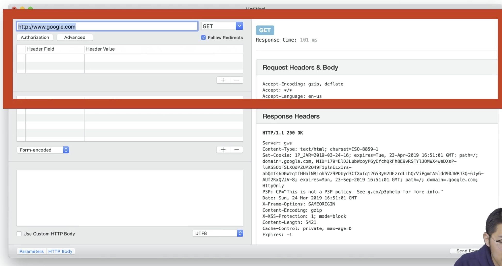
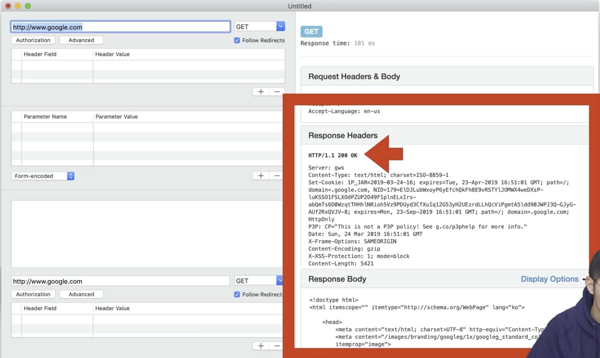
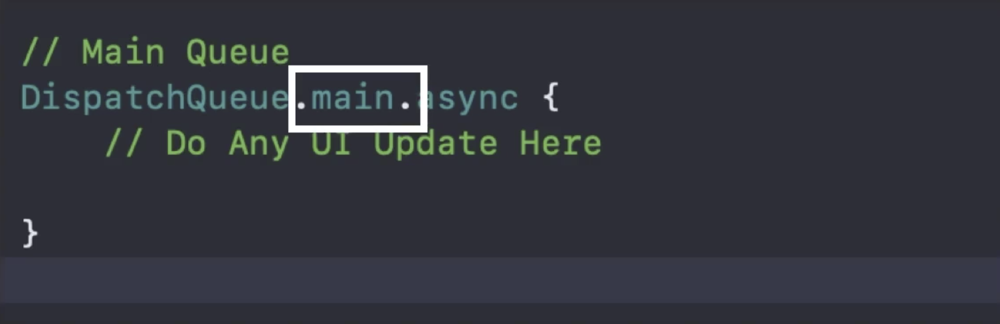
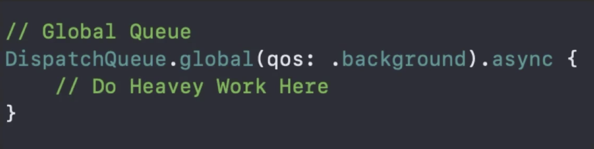
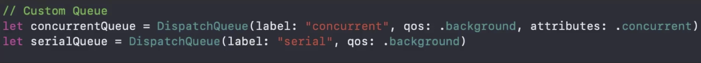
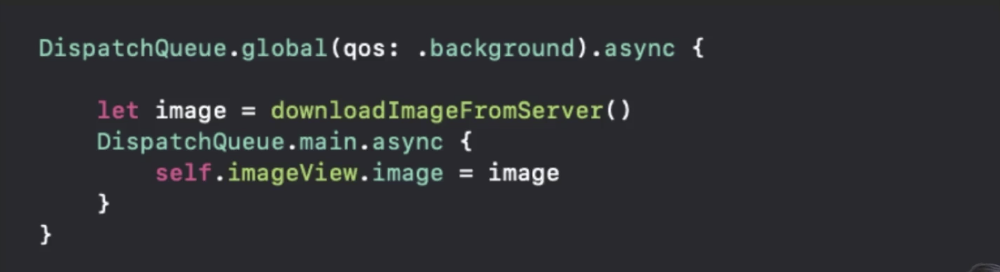
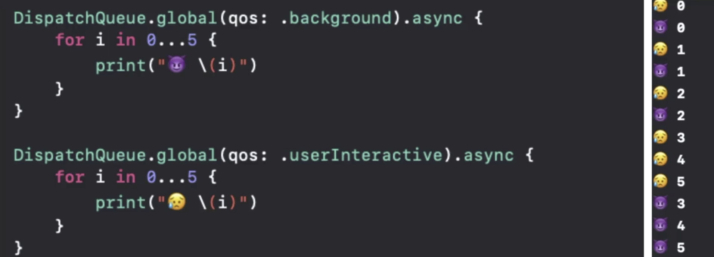
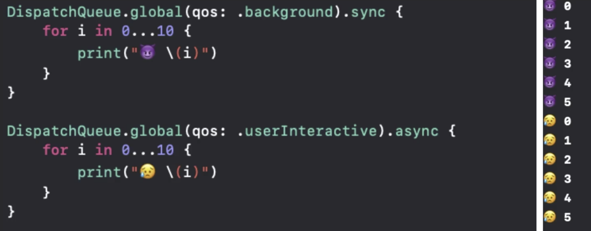

# - Networking on iOS ?
네트워킹이랑 서버와 앱 간에 데이터를 주고받는 것.

그렇다면, 어떻게 데이터를 주고 받을까?

HTTP 방법으로 REST API 를 이용하여 JSON 형태의 데이터를 주고 받는다.

 

## - HTTP ?
Hyper Text Transfer Protocol

 

## - 동작 방식 ? 
기본적으로 서버와 클라이언트는 메세지를 주고 받는 형식으로 의사소통을 한다.

클라이언트의 요청, 서버의 응답.

 

## - HTTP Request Method
1. POST: Create [해당 URL에 새로운 데이터 생성을 요구할 때]
2. GET: Read [해당 URL에 있는 데이터를 보고 싶을 때]
3. UPDATE: Update [해당 URL에 있는 데이터를 수정하고 싶을 때]
4. DELETE: Delete [해당 URL에 있는 데이터를 삭제하고 싶을 떄]

- Ex) 웹 브라우저의 주소창에 [https://www.google.com] 이 **_URL_** 을 입력하고 엔터를 누르는 순간, Client 가 Server 에 HTTP Request 를 보내는 행위이다.

 

## - URL
Uniform Resource Locator. 즉, 웹 리소스의 주소를 가리킨다.

다큐먼트든, 이미지 파일이건, 해당하는 웹 리소스를 **_[URL: 주소]_** 알아야 가져올 수 있는 것.

 

아래 사진을 보면, HTTP Request를 요청할 때, Headers 와 Body 를 통해서 우리가 필요한 정보를 요청한다는 것을 알 수 있다.

 

아래를 사진을 보면, 서버로부터 받은 응답 데이터, 즉 Response 역시 Headers 와 Body 가 나뉘어서 옴을 알 수 있다. 

Headers 에는 아주 중요한 정보인 상태[Status] 코드가 같이 내려온다. 200 OK

Bodys 에는 실제 Google 화면을 이루기 위한 html 파일이 내려온 것을 알 수가 있다.

 

## - Content-Type 
응답(Response) 데이터의 타입을 알려준다.
1. text/html
2. application/json
3. image/png
4. video/mpeg

 

## - HLS (HTTP Live Streaming)
예전에는 HTTP 를 통해서 txt 파일만 주고받을 정도여서, 동영상을 비롯한 다른 데이터를 전달하기에는 RTMP 라는 프로토콜을 이용해서 주고 받았다. 그러나 이제는 기술이 좋아져서 HTTP 를 통해서도 가능해졌고, 그 중에서도 HLS 라는 녀석이 동영상과 음원 스트리밍에서 주로 사용된다.

 

## - Concurrency 
동시성: 앱이 한번에 여러 일을 수행하는 것

 

## - APP 이 하는 일?
1. 사용자 인터렉션 처리 -> 작업 1
2. 네트워킹 -> 작업 2
3. 백그라운드에서 파일 다운로드 -> 작업 3
4. 파일 저장하고 읽기 -> 작업 4

이 작업들은 Thread 라고 부른다. 즉, Thread 1,2,3,4.

Context Switching 을 하면서 Thread 를 넘나들며 작업을 수행한다. 이때 소요되는 시간이 아주 짧기 때문에 사용자들은 '동시에 작업되고 있구나'라고 느끼게 되는 것이다. 이게 바로 Concurrency.

  

# * 결론

APP 은 여러개의 Thread 로 구성되며, 이 Thread 는 동시에 수행되는 것처럼 보여야 한다. 이때 동시성을 가졌다고 말을 할 수 있는 것이다. 이러기 위해서는 스레드에서 수행되는 일들을 아주 작은 단위로 나누어서 여러 스레드를 번갈아가면서 수행해나가면 된다.

이 때 앱의 반응성을 빠르게 가져가기 위해서는, 작업이 우선되어야 하는 것을 Main Thread 로 두고(UI와 관련된 것이거나 사용자 인터랙션을 처리한는 것), 반응이 느리거나(Networking 등) 기타 우선 순위가 낮은 것들을 다른 Thread 에 두고 작업할 수 있도록 코드를 작성해주어야 한다.

  

## - GCD
Grand Central Dispatch!

Concurrency 를 제공해주기 위한 API 가 GCD 이다.

GCD 는 Thread 위에 만들어진, 상위 개념이다.

GCD 는 task 를 queue 를 이용해서 관리한다.

 

## Dispatch Queue
1. Main Queue 
    - Main Thread 에서 작동하는 Queue
    
    
2. Global Queue
    - System 에 의해 관리되는 Concurrent Queue
    - Global Queue 안에서는 우선 순위를 정해서 일을 처리할 수 있다.
    - QoS(Quality of Service) Class 를 통해서 글로벌 큐 내의 우선 순위를 정한다.
    - 우선 순위 5가지 
        + 1.userInteractive
            + 거의 바로 수행되어야 할. 제일 급한 것.
        + 2.userInitiated
            + 사용자의 결과를 기다려야하는 작업. 꽤 바로.
        + 3.default
            + 잘 쓰지 않는다.
        + 4.utility
            + 수 초~ 수 분까지 걸리는 작업. 네트워킹이나 파일 불러오기 등 시간이 걸리는 작업에 사용.
        + 5.background
            + 사용자에게 당장 인식될 필요가 없는 작업에 대해 사용. 뉴스를 미리 다운을 받아놓는다던지, 사용자 인식에 관계 없이 위치를 업데이트 해준다던지, 큰 영상을 다운받는다던지. 

    

3. Custom Queue
    - 시스템에서 제공해주는 디스패치 큐(Main Queue, Global Queue) 가 아니라 직접 디스패치 큐를 생성해서 사용할 수도 있다.

    
    사용용도에 따라 QoS와 attributes 를 설정할 수 있다.

 

## - 두 개의 Queue 를 같이 사용하기
이미지를 다운받는 작업과, 다운받은 후에 화면에 보여주는 작업. 이렇게 작업 간에 의존을 하는, 이어지는 작업일 경우 두 개의 Queue 를 이용해서 복합적으로 사용할 때 가 있다.

이미지를 다운 받는 것만 봤을 때에는, Global Queue 중에서도 background 에서 작업되야할 정도로 오래 걸리는 작업일 수 있다.

그러나 이 이미지를 활용하는 것은 중요한 작업이기 때문에, 이미지 다운로드가 끝나면, 메인 스레드로 넘겨서 작업을 이어서 해나가는 것.

이런 방식의 코딩을 많이 한다고 함.

 

## - Sync & Async
큐에 들어온 테스크를 어떻게 수행할지 봐야 한다. GCD 에서는 테스크를 동기&비동기 식으로 사용할 수 있다.

Sync 는 앞의 일이 끝난 후에 다음 일을 시작하는 방식이고, Async 는 앞의 작업이 끝나지 않았음에도 다음 일을 시작하는 것이다.

 

## Async (비동기)
async로 둔 선행 작업이 끝나기 전에 뒤에 작업이 시작되며, 뒤에 시작된 것이 우선순위가 높다면 당연히 뒤에 작업을 우선시하여 수행한다. 라는 게 아래의 예제.

 

## Sync (동기)
sync로 둔 선행 작업이 끝나야만 뒤에 작업이 시작된다. 이떄 뒤의 작업이 무엇인지는 관심 없다.

  

# *결론
Sync로 작업하는 것은 위험이 따른다.

가령, 이미지 다운로드를 Sync 로 작업한다면.. 으악.

이 말고도 필요할 때에만 Sync 를 잘 써주고, 왠만하면 Async 로!