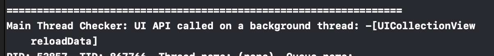
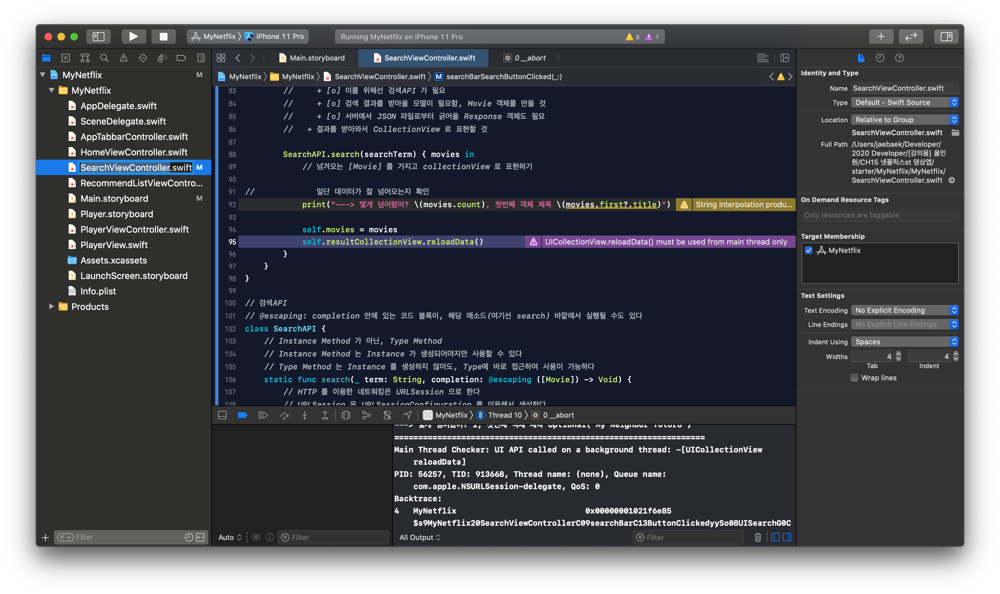
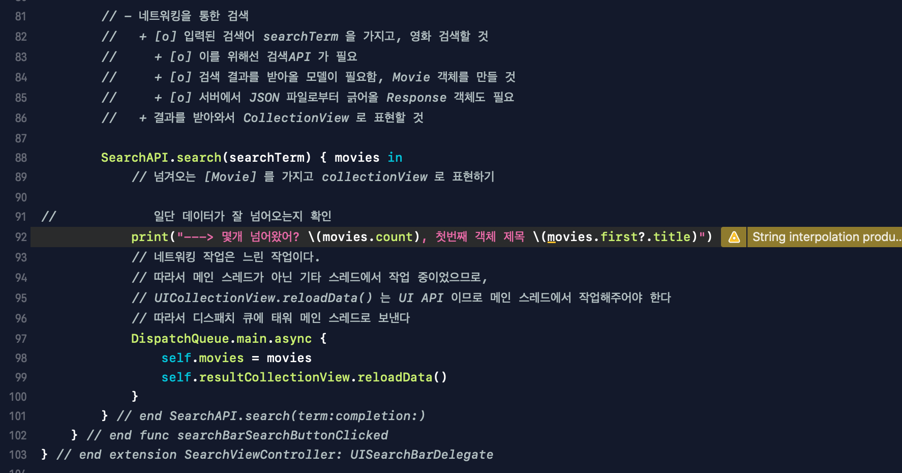

# * UICollectionView.reloadData() must be used from main thread only

self.resultCollectionView.reloadData()

이를 extension 뷰컨트롤러 내부에 선언했더니 아래와 같은 에러가 떴다.

보라색으로 뜬 에러는 처음 보는데, 이게 Main Thread Checker 가 에러를 잡았다는 의미인듯.

* Main Thread Checker: UI API called on a background thread 
 
    - > UI API 는 백그라운드 스레드에서 불려져서는 안된다. 

    - 여기서 말하는 UI API 는 # UICollectionView.reloadData()

* UICollectionView.reloadData() must be used from main thread only

 

 

  

## - 문제가 되는 이유
네트워킹 작업은 느린 작업이다. 따라서 네트워킹은 메인 스레드에서 작업하지 않고, 기타 다른 스레드로 보내진다. 그런데, 네트워킹 작업을 하는 환경 내에서 UI API를 건드리는 작업을 했으니 문제가 생긴 것이다. UI API는 메인 스레이드에서만 작동할 수 있는 작업이기 때문이다.

 

## - 해결 방안
디스패치 큐에 태워 메인 스레드로 보내면 된다.

