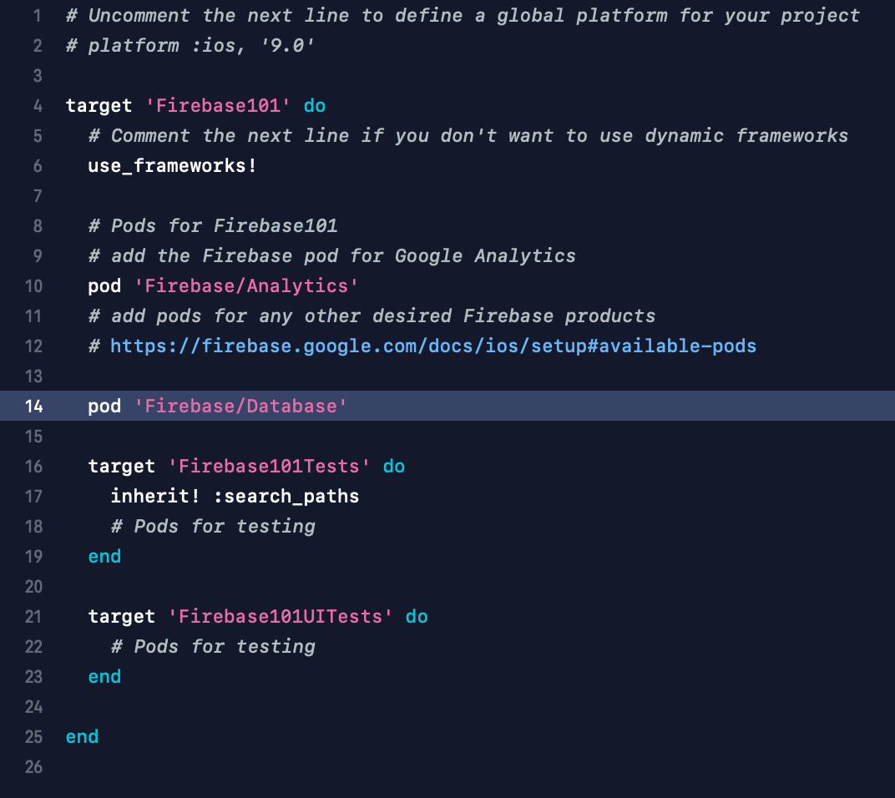
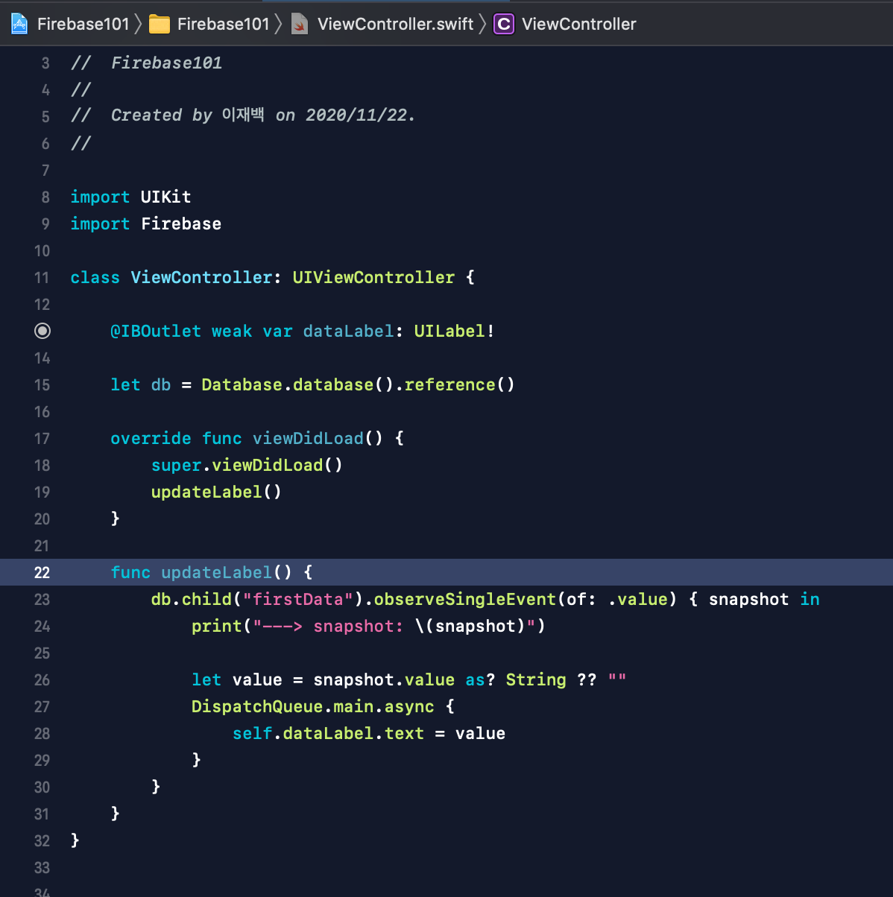

# How to use Realtime Database
Firebase 공식 문서를 보고 따라하면 된다.

현재, Firebase 프로젝트를 만들고, Firebase에 앱을 등록해놓은 상태.

이번엔 Realtime Database를 사용해볼 것이다.

## - Firebase의 데이터 읽어오기
[공식 문서: Realtime Database 시작하기](https://firebase.google.com/docs/database/ios/start)

공식 문서로 가서 시키는 대로 따라한다.

그 후 아무 데이터나 넣고 불러오기를 해본다.

 

