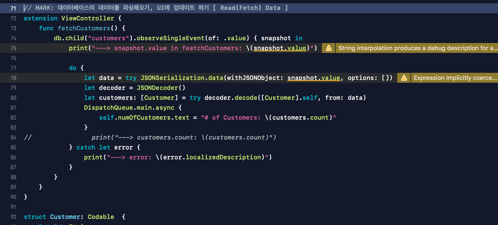
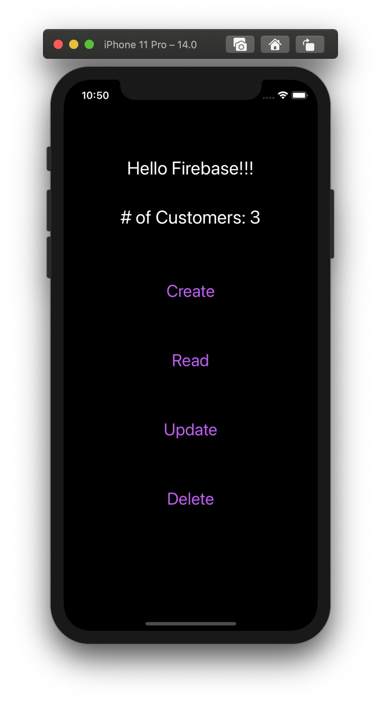

# How to use Realtime Database
Firebase 공식 문서를 보고 따라하면 된다.

현재, Firebase 프로젝트를 만들고, Firebase에 앱을 등록해놓은 상태.

이번엔 Realtime Database를 사용해볼 것이다.

## - Firebase의 데이터 읽어오기
[Realtime Database 시작하기](https://firebase.google.com/docs/database/ios/start)

공식 문서로 가서 시키는 대로 따라한다.

그 후 아무 데이터나 넣고 불러오기를 해본다.


<br>

## - Firebase에 데이터 추가하기

```
//
//  ViewController.swift
//  Firebase101
//
//  Created by 이재백 on 2020/11/22.
//

import UIKit
import Firebase

class ViewController: UIViewController {
    
    @IBOutlet weak var dataLabel: UILabel!
    
    let db = Database.database().reference()
    
    override func viewDidLoad() {
        super.viewDidLoad()
        updateLabel()
        saveBasicType()
        saveCustomers()
    }
    
}

extension ViewController {
    func saveBasicType() {
        // ref: self.ref.child("users").child(user.uid).setValue(["username": username])
        // - NSString, NSNumber, NSDictionary. NSArray
        
        db.child("int").setValue(3)
        db.child("double").setValue(3.5)
        db.child("str").setValue("string value - 안녕하세요")
        db.child("array").setValue(["a", "b", "c"])
        db.child("dict").setValue(["id": "anyID", "age": 10, "city": "daegu" ])
    }
    
    func saveCustomers() {
        // To do
        // - 여기는 책 가게이며, 회원 등록을 하고 싶다
        // - Customer 모델에다 저장할 것이고, 각 고객들은 [Book]을 가지고 있다
        
        let books = [Book(title: "Good to Great", author: "Somebody"), Book(title: "Hacking Growth", author: "Somebody")]
        let customer1 = Customer(id: "\(Customer.id)", name: "Son", books: books)
        Customer.id += 1
        let customer2 = Customer(id: "\(Customer.id)", name: "JB", books: books)
        Customer.id += 1
        let customer3 = Customer(id: "\(Customer.id)", name: "SR", books: books)
        Customer.id += 1
    
        db.child("customers").child(customer1.id).setValue(customer1.toDictionary)
        db.child("customers").child(customer2.id).setValue(customer2.toDictionary)
        db.child("customers").child(customer3.id).setValue(customer3.toDictionary)

    }
    
    func updateLabel() {
        db.child("firstData").observeSingleEvent(of: .value) { snapshot in
            print("---> snapshot: \(snapshot)")
            
            let value = snapshot.value as? String ?? ""
            DispatchQueue.main.async {
                self.dataLabel.text = value
            }
        }
    } // end func updateLabel()

} // end extension ViewController

struct Customer {
    let id: String
    let name: String
    let books: [Book]
    
    var toDictionary: [String: Any] {
        let booksArray = books.map { $0.toDictionary }
//        var booksArray: [[String: Any]] = []
//        for book in books {
//            booksArray.append(book.toDictionary)
//        }
        print("books in Customer: \(books)")
        print("booksArray in Customer: \(booksArray)")
        let dict: [String: Any] = ["id": id, "name": name, "books": booksArray]
        print("dict in Customer: \(dict)")
        return dict
    }
    
    static var id: Int = 0
}

struct Book {
    let title: String
    let author: String
    
    var toDictionary: [String: Any] {
        let dict: [String: Any] = ["title": title, "author": author]
        print("dict in Book: \(dict)")
        return dict
    }
}
```

<br>

## - Read(Fetch Data)
데이터 읽어오고, 파싱하고, UI에 업데이트 하기!

obersveSingleEvent를 통해 snapshot의 형태로 데이터베이스에 있는 JSON 형태의 데이터를 가지고 온다.

이 데이터를 가지고 JSONDecoder를 통해 디코딩할 것인데, 이 때 Data 타입이 필요하기에 Data 타입으로 변환을 해준다.

JSONSerialization.data(withJSONObject:options:) 를 통해 Data 타입으로 변환.

그 후 JSONDecoder 를 생성하여, decode 하면 된다.

이때 데이터베이스의 변수명과 내가 사용하고자 하는 변수명과 같기에 열거형 & (CodingKey & CodingKeys)는 사용하지 않아도 된다.



## - Update & Delete + IBAction
Update 와 Delete를 해본 후, UIButton을 통해 CRUD(Create, Read, Update, Delete)가 가능하도록 해보았다.

자세한 코드는 zip 파일로 첨부하였다.


