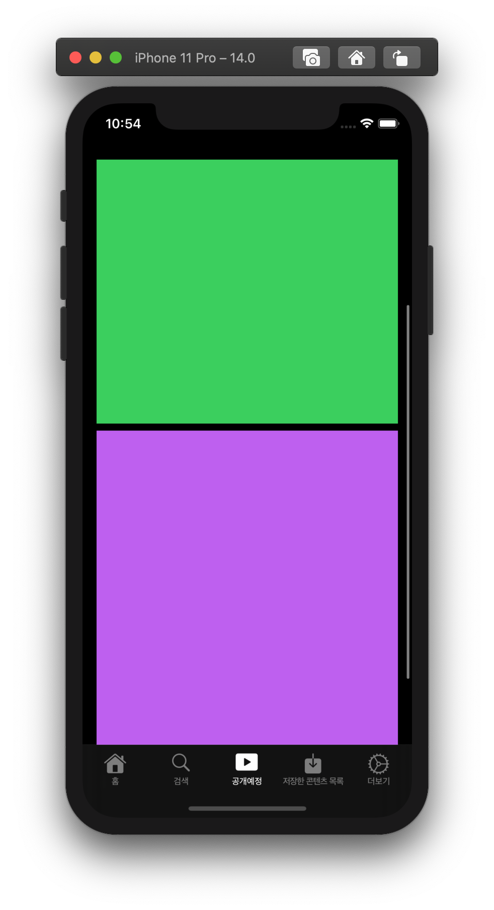

## - Nested Scroll View
위~아래, 좌~우로 스크롤되는 우리가 흔히볼 수 있는 뷰! (애플의 앱 스토어나 구글의 플레이스토어, 넷플릭스 등)

이 뷰를 어떻게 구현하는지 알아볼 예정 !

> 채워지지 않은 네비게이션 바 '공개 예정'

 

## - Firebase 활용
검색어를 Firebase에 데이터베이스로 저장을 한 후, 이를 가지고 저장한 컨텐츠 목록 뷰(라고는 하지만 최근 검색어 목록 뷰인듯)를 만들어볼 예정 !
(저장한 컨텐츠 목록 혹은 최근 검색어 목록으로 활용될 수 있음)

> 채워지지 않은 네비게이션 바 '저장된 컨텐츠 목록'

 

# Scroll View의 두가지 개념
배웠던 것들 중 컬렉션 뷰와 테이블 뷰가 스크롤 뷰를 상속받는 뷰이다.

스크롤 뷰에는 스크롤 뷰와 컨텐츠 뷰가 있다.

스크롤 뷰는 창문, 컨텐츠 뷰는 창문을 통해 보여지는 풍경에 비유할 수 있다.

즉, 스토리보드에서 UI Component 중 Scroll View를 추가하고, 레이아웃을 준다고 해도 오류가 뜬다. 컨텐츠 뷰가 될 View를 추가하고, View(컨텐츠 뷰가 될 뷰)의 레이아웃이 필요하기 때문이다.

컨텐츠 뷰의 Height 레이아웃의 Priority를 250(Low)로 설정한다. 이 높이에 대한 제약이 약하다는 건, 다른 요인에 의해 높이가 변경될 수 있음을 말한다.

 

## - ScrollView Test

스크롤 뷰 안에 컨텐츠 뷰를 넣고 그 안에 이미지 뷰와 스택 뷰, 그리고 스택 뷰 안에 뷰를 넣었다.
이미지 뷰와 뷰에 색을 칠해서 스크롤 뷰가 제대로 동작하는지 보았다.

 

## - ScrollView Ex

ScrollView 내부의 StackView 안에 컨텐츠 뷰를 VIew로 헀었다. 

이번엔 View가 아니라, Container View라는 UI Componenet 를 활용해서 그 공간에 '뷰 컨트롤러'를 집어넣을 것이다.

그 안에 CollectionView 를 넣어서 횡스크롤(Horizontal Scroll)이 가능하도록 구현해볼 것이다.

 

컬렉션 뷰가 좌우로 스르륵 스르륵 한다.

