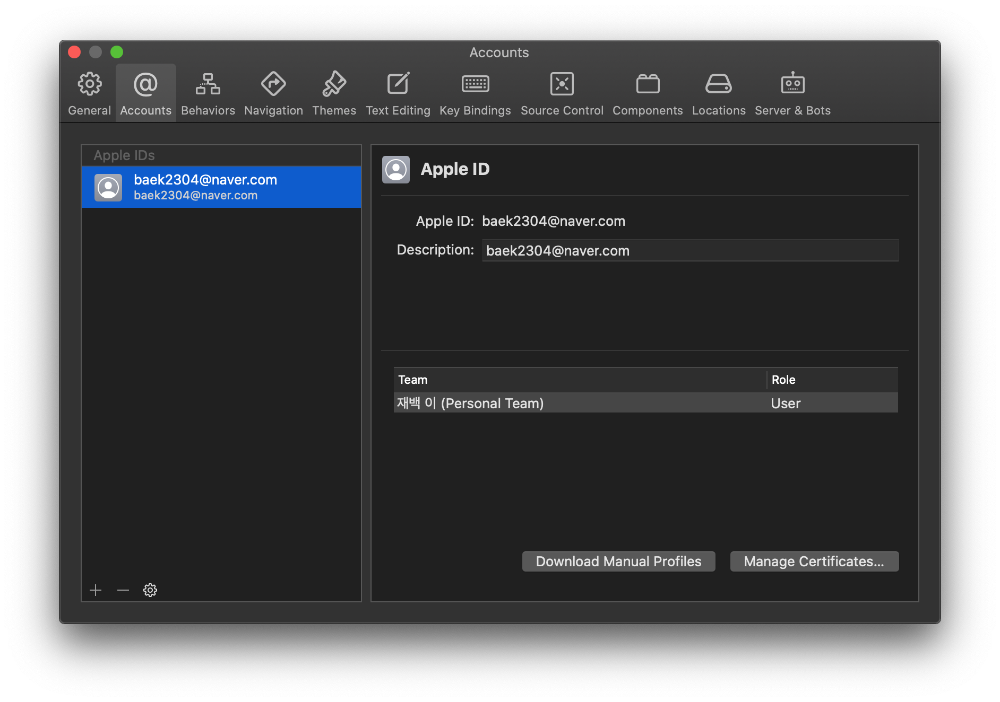
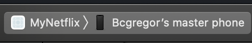
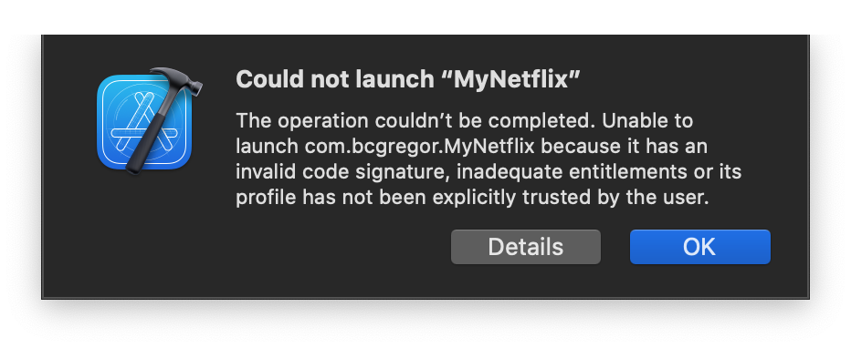

# Sideload
내가 만든 앱을 iOS에 설치해서 사용해보는 것.

아래 사진처럼 행하면, 중간 중간에 몇가지 오류를 만나게 될지도 모르는데, 하나씩 차근차근 해결해나가면 된다.

그 중에 반드시 만나게 될 오류가 있는데, 인증되지 않은 개발자의 앱이라서 신뢰를 해야 설치가 가능해진다는 점?

이는 설치될 기기에서 설정을 해주어야 한다.

설정 > 일반 -> 기기 관리 > 해당 앱을 신뢰

아래가 반드시 만나게 될 오류 메세지다. 아이폰의 설정에 들어가서 '신뢰'해주면 실제로 어플이 설치되면서 내 휴대폰에서도 내가 만든 앱을 만져볼 수 있다.

