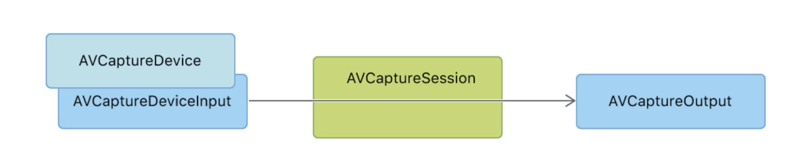

# AVFoundation Framework
Audiovisual Media에 특화되어 있는 공구함.
> capturing, processing, synthesizing, controlling, importing, exporting, ...

 

## - Playback and Editing
코드로 바꿔줄 추상화된 객체들을 많이 가지고 있다.

AVPlayer에게 AVPlayerItem이라는 추상화된 객체로 전달했다. (미디어, 오디오, 등 여러가지의 형태를 담을 수 있는 게 AVPlayerItem)

  

## - Media Capture
아이폰의 카메라나 마이크를 통해 들어오는 비디오, 오디오 데이털르 저장할 수 있게끔 해준다.

 

## - Audio
오디오 믹싱을 통해 음악을 만드는 앱 등에 사용된다.

  

## - Speech
목소리를 텍스트로 변환해주는 STT(Speach to Text) 도구를 제공해준다. 

 

> 우리는 이 중에서도 카메라 앱을 만들 것이기에 Media Capture 관련한 도구들을 가져다 쓰면 된다.

 

# - 어떤 앱을 만들 것인가?
1. 기본 카메라 앱과는 다른 UI를 가진다. [ 앱 자체의 UI ]
2. 노출이나 조리개 값 등, 기본 앱에서는 건드릴 수 없는 값들을 직접 설정할 수 있다. [ 사진 촬영 시 ]
3. 워터마크, 자막 등 사진 편집을 할 수 있다. [ 후 보정 ]
4. 필터나 이모지를 적용한다. [ 동영상 촬영 시 등 ]

> 1. Custom UI
> 2. Direct Controll
> 3. Title, Watermark, Filter
> 4. AR Emoji
> 
> 위와 같은 기능을 추가할 게 아니라면 기본 카메라를 가지고 만들면 된다.
> UIImagePickerController를 이용하면 시스템 카메라(기본 카메라 앱)을 가져다 쓸 수 있다.

 

# - Media Capture의 3가지 요소

1. AVCaptureSession
    - 카메라나 마이크 같은 인풋 데이터를 아웃풋으로 연결시켜주는 중간 역할
2. AVCaptureDeviceInput
    - 미디어 소스를 제공해주는 카메라 혹은 마이크가 여기에 해당
3. AVCaptureOutput
    - 인풋으로 들어오는 데이터를 가지고서 디스크에 데이터를 쓰든지, 프로세싱을 하든 할 때 사용되는 게 아웃풋

