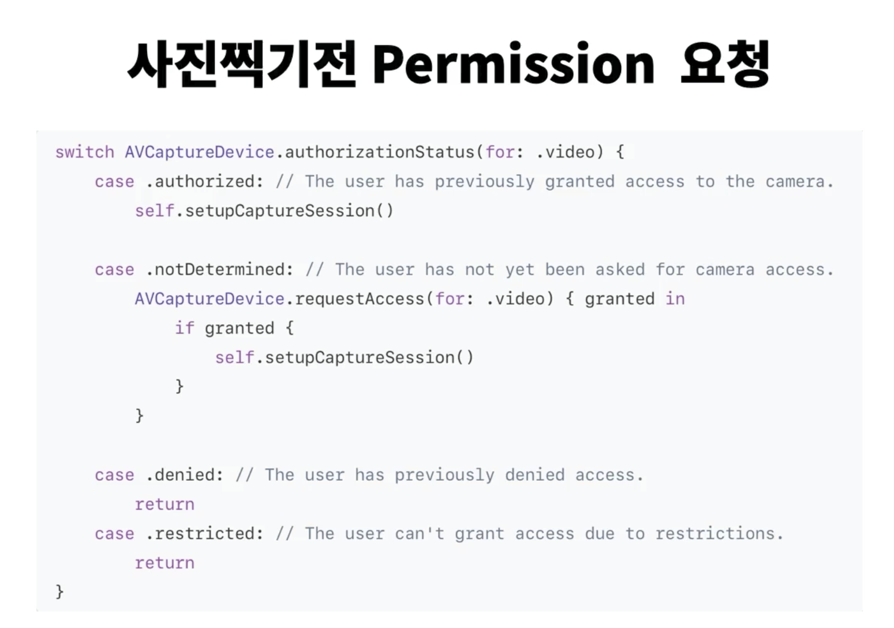
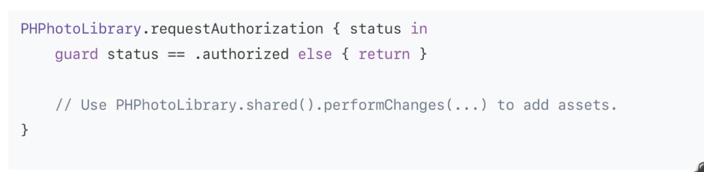
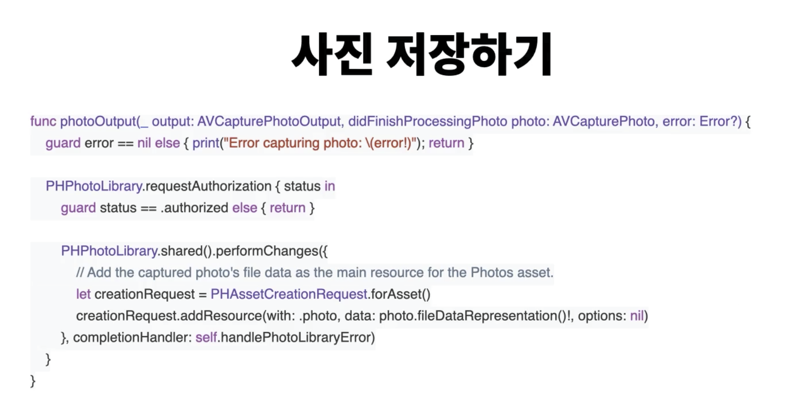
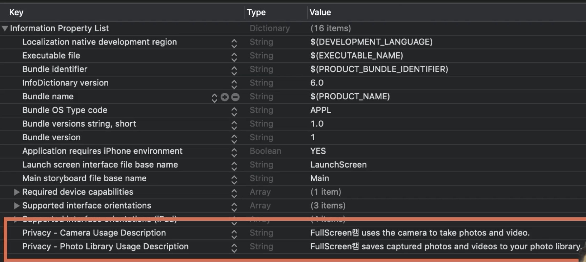

# ✔ Permission
카메라 앱에서 필요한 권한에 대해 알아보고, 그 권한을 얻는 법에 대해 알아볼 것이다.

Info.plist 안에서 카메라와 마이크에 접근해서 사용할 것이다. 라는 디스크립션을 써야 한다.
> Camera, mic usage description in Info.plist

1. 사진 찍기 전 Permission 요청

2. 사진 저장 전 Photo Library Permission 요청

3. 사진 저장하기
]

> 위 코드들은 애플 공식 문서상의 코드라고 함.

 

