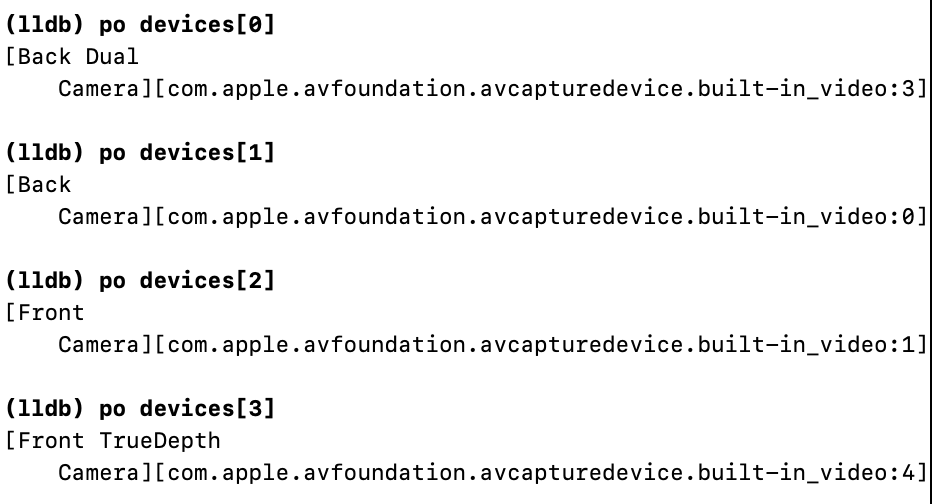

## 의문점 1. 전면, 후면 카메라의 이름?
builtInDualCamera, .builtInWideAngleCamera, .builtInTrueDepthCamera 이 3가지 타입 중에 어느 것이 전면 카메라고 어느 것이 후면 카메라일까?

```
AVCaptureDevice.DiscoverySession(deviceTypes: [.builtInDualCamera, .builtInWideAngleCamera, .builtInTrueDepthCamera], mediaType: .video, position: .unspecified)
```




