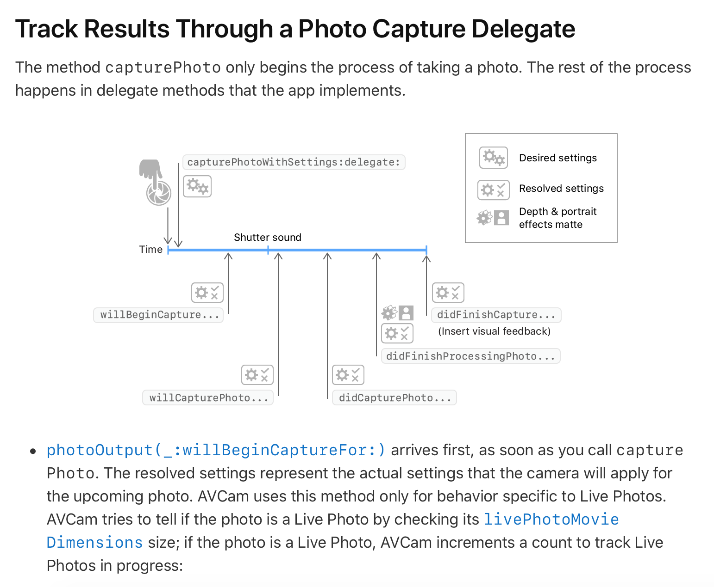
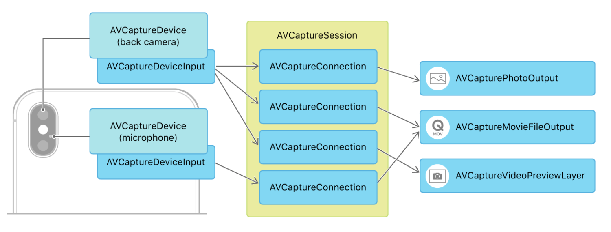

# AVCam
전체적인 흐름에 대해 알아보자

[AVCam in Apple Developer](https://developer.apple.com/documentation/avfoundation/cameras_and_media_capture/avcam_building_a_camera_app)

 

# Setting Up a Capture Session
[Setting Up a Capture Session in Apple Developer](https://developer.apple.com/documentation/avfoundation/cameras_and_media_capture/setting_up_a_capture_session)

 

# Choosing a Capture Device
[Choosing a Capture Device in Apple Developer](https://developer.apple.com/documentation/avfoundation/cameras_and_media_capture/choosing_a_capture_device)

