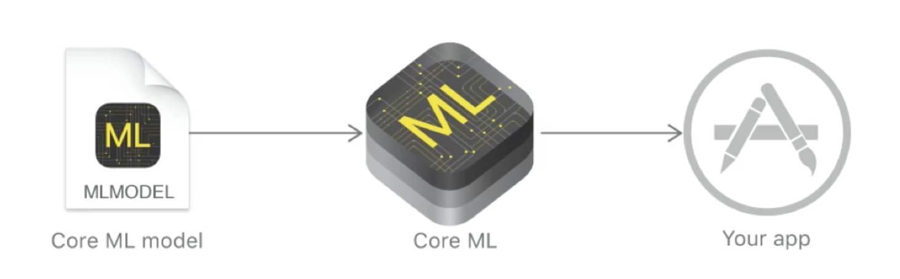
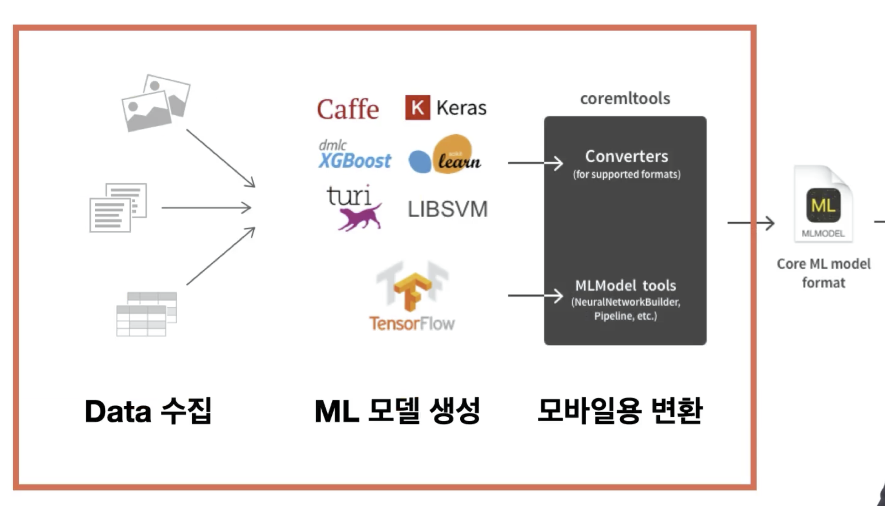
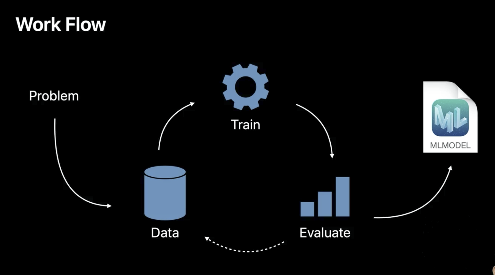

# CoreML
Apple 에서 제공해주는 Machine Learning Framework.

_**딥 러닝**_ 이 머신 러닝(기계 학습: 인공지능)의 시대를 활짝 열어줌.

_상품 추천, 자율 주행, 건강 진단 등 여러 분야에서 활약 중인 머신 러닝._

머신 러닝이 뛰어난 성능을 가지고 있지만, 아직 가치화되지 않은 부분들이 많다.

고로, 아이폰 앱 개발 시 머신 러닝을 활용할 수 있으면 좋을 것이다.

Apple / Google 이 Mobile Machine Learning Framework 에 힘쓰고 있다.

**CoreML** 은 2017년에 출시 되었다.

크게 이미지 분석, 자연어 처리, 오디오 분석

 
 

 

## Teachable Machine by Google
Train a computer to recognize your own images, sounds, & poses. 

이 Teachable Machine 을 통해서 누구나 쉽게 머신 러닝을 만들 수 있다.

아직은 이미지, 포즈, 소리에 대한 것만!

## CreateML by Apple

이런 과정을 거쳐서 앱에서 가져다 쓸 수 있게끔 해준다.

Data: Image, Video, Motion, Sound, Text, Table

 

[CoreML 참고 문서: Apple Developer Documentation](https://developer.apple.com/documentation/createml/improving_your_model_s_accuracy)

[Precision and Recall](https://en.wikipedia.org/wiki/Precision_and_recall)
