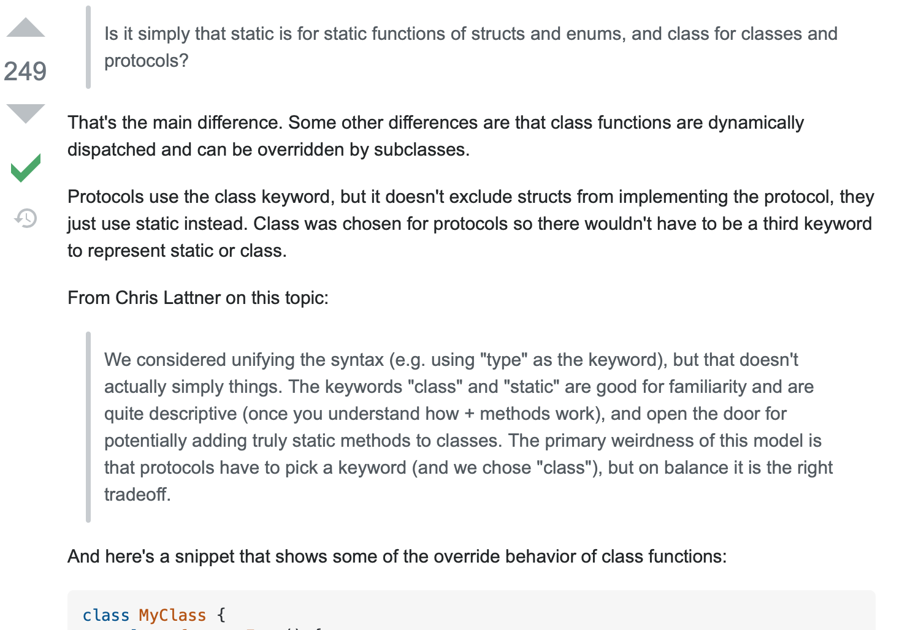
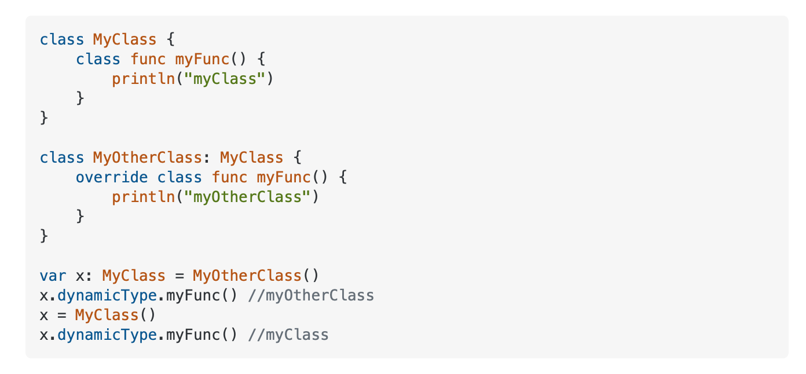

# 2. class func VS static func
◼️ 의문의 시작점

- 애니메이션을 공부하고 있는데, 여기서 UIView.animate() 이런식으로 사용을 했다. 선언으로 가보니 open class UIView 였는데, 어떻게 오브젝트의 내부에 있는 animate와 transition을 사용가능할까? 에서 출발되었다.

- 함수들의 선언부를 가보면 open class func animate, open class func transition 으로 되어있는데, 구조체에 대해 배울 때 객체 자신의 프로퍼티, 즉 type property에 바로 접근할 수 있다고 배웠다. 이 타입 프로퍼티는 static 키워드를 사용하는데.. 

- 
- 이 답변에 따르면, static 키워드는 구조체와 이넘 타입에 대해 사용하는 키워드이며, class 키워드는 클래스와 프로토콜을 위한 키워드라고 하는 것 같다. 이게 맞는가?
 > Is it simply that static is for static functions of structs and enums, and class for classes and protocols?
That's the main difference. Some other differences are that class functions are dynamically dispatched and can be overridden by subclasses.
> 
> Protocols use the class keyword, but it doesn't exclude structs from implementing the protocol, they just use static instead. Class was chosen for protocols so there wouldn't have to be a third keyword to represent static or class.
> 
> From Chris Lattner on this topic:
> 
> We considered unifying the syntax (e.g. using "type" as the keyword), but that doesn't actually simply things. The keywords "class" and "static" are good for familiarity and are quite descriptive (once you understand how + methods work), and open the door for potentially adding truly static methods to classes. The primary weirdness of this model is that protocols have to pick a keyword (and we chose "class"), but on balance it is the right tradeoff.

- 무튼 예제를 봐보자.
- 

- 요약하자면, static func 이나 class func 이 가지는 의미는 같고, 사용되는 타입이 다르다. static 키워드는 structs, enums 을 위해서. calss 키워드는 classes, protocols 을 위해서
- 당연히 이게 내가 이해하고 넘어가야 할 전부가 아니라고 생각하기에 이곳에 기록한다.